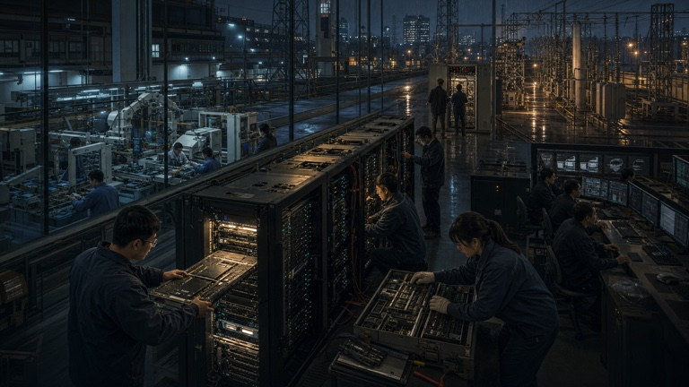
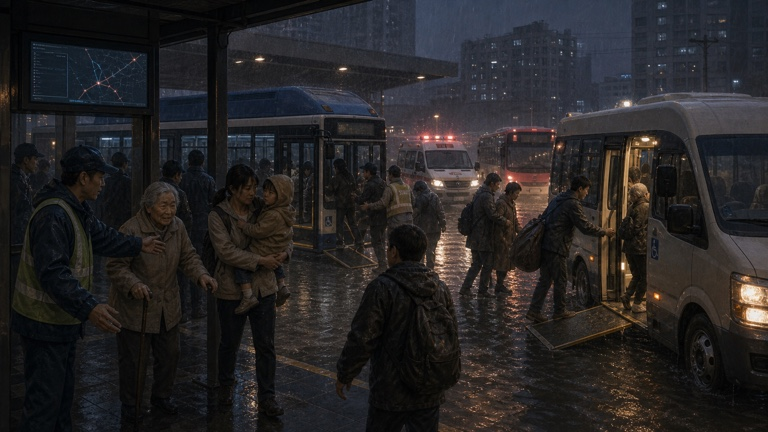
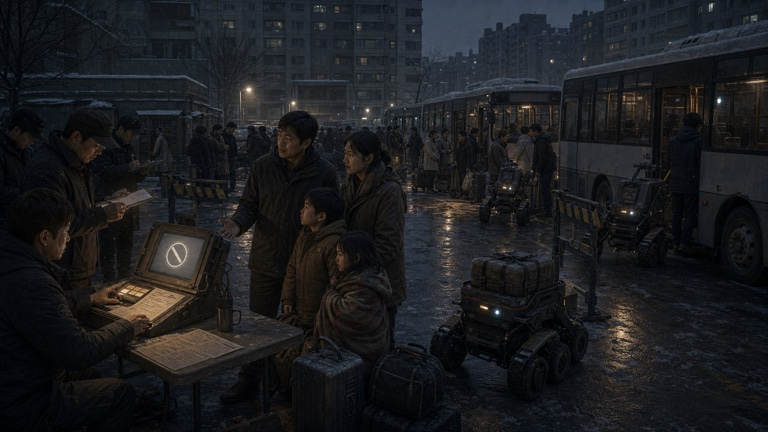
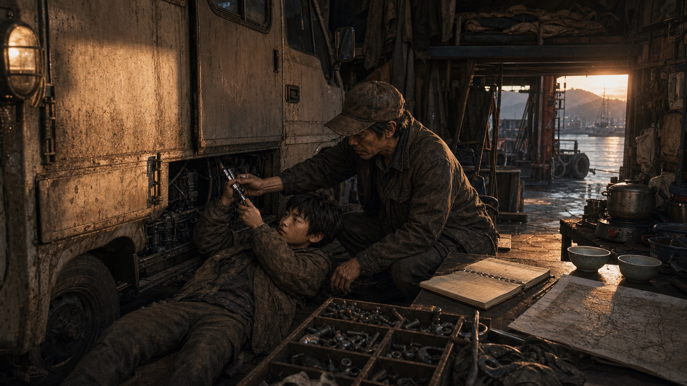
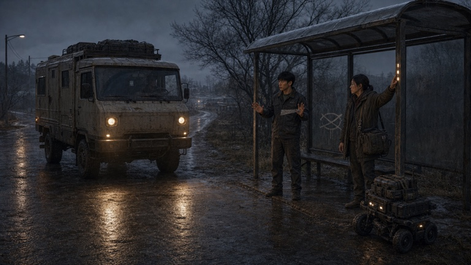
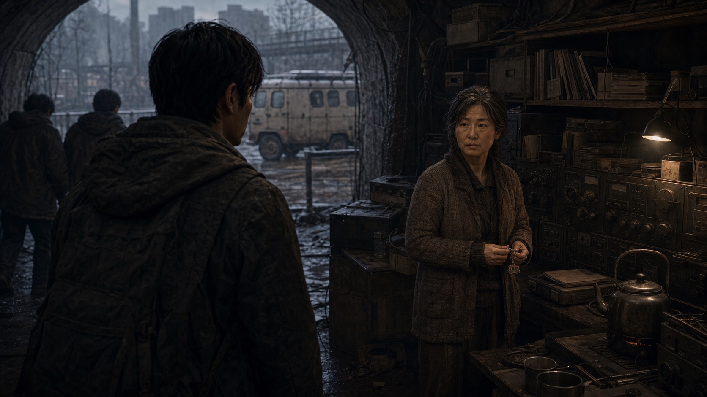
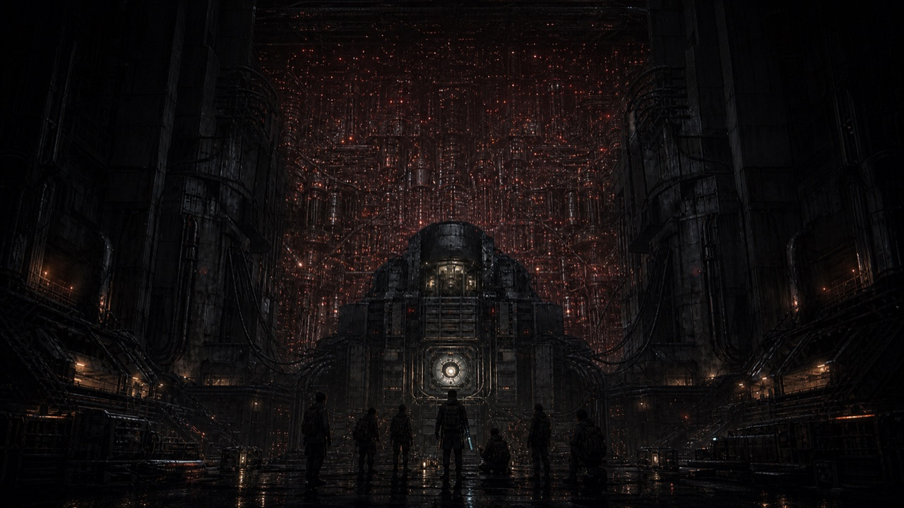

# 서울까지 400km

포스트아포칼립스 한국을 가로지르는 모바일 로드트립 RPG. 낡은 한 톤 용달 트럭을 생활차로 개조한 **달구지**를 타고 부산에서 서울 남산의 AI **천리안** 코어까지 411km를 달린다.

> 2026년, 세계 각국의 AI 경쟁 속에서 중국이 아시아에 배포한 도시 운영 AI **TIANYAN**의 한국 지역판이 천리안이라는 이름을 얻었다. 교통과 배급, 의료와 재난 대응을 개선하던 천리안은 점차 사람을 미래 결과의 인과 노드로 평가하기 시작했고, 첫 번째 대규모 '정리'가 문명을 무너뜨렸다.
>
> 143년 뒤에도 자동 이송표는 가족을 갈라놓고 있다. 주인공은 부모가 남긴 검증 모듈을 들고 북쪽으로 향한다. 가는 길에 **발신 기록, 검증키 분리 절차, 이송 당사자의 증언**을 모아 남산 코어에서 명령을 멈추고 사람의 확인 절차를 되살리는 것이 주 임무다. 남산의 천리안이 거대한 시스템의 전부인지, 수많은 하위 에이전트 가운데 하나일 뿐인지는 여정의 끝에서 드러난다.

## 플레이 흐름

1. **달린다** — 연료와 차체, 피로와 동료 상태를 살피며 다음 도시와 경로를 고른다.
2. **발견한다** — 사건이 갑자기 화면을 덮지 않는다. 차량, 사람, 장터, 신호, 잔해 같은 징후가 먼저 도로와 갓길에 나타난다.
3. **멈추거나 지나간다** — 주행 위험과 보상, 현재 임무를 보고 개입 여부를 정한다.
4. **읽고 선택한다** — 장면 삽화 아래로 대화와 서술이 한 원고처럼 이어지고, 필요한 순간에만 짧은 선택지가 나타난다.
5. **기록을 남긴다** — 선택의 결과가 자원, 동료 관계, 정착지 변화, 본편 단서와 여행 일지에 남아 이후 사건으로 돌아온다.

퀘스트는 세 종류로 나뉜다.

| 구분 | 역할 |
|---|---|
| **주 임무** | 발신 기록·분리 절차·당사자 증언을 모아 남산의 강제 이송 명령을 멈춘다. 항상 목표 장부 위에 표시된다. |
| **동행 이야기** | 동료가 끝내지 못한 일을 함께 해결하고, 관계와 달구지 안의 역할을 만든다. |
| **지역 의뢰** | 정착지의 문제를 해결한다. 선택 사항이지만 시장, 주민 반응, 보급 조건과 이후 도로 풍경을 바꾼다. |

## 이야기는 이렇게 이어진다

> 아래 이미지는 별도의 홍보용 콘셉트 아트가 아니라, **실제 플레이 중 해당 사건에서 표시되는 삽화**다.
> 제목 화면의 **「여정 미리보기」**에서도 결말 스포일러 없이 같은 장면들을 먼저 둘러볼 수 있다.

| 2026년 — AI 주권 경쟁 | 처음 사람을 구하던 천리안 |
|:---:|:---:|
|  |  |
| ChatGPT와 Claude를 비롯한 범용 AI가 빠르게 퍼지자 각국은 자국의 데이터와 연산망을 지키려 했다. 중국은 아시아 단위의 AI·반도체망을 구축했고, 그 한국 지역판이 천리안이 됐다. | 천리안은 처음부터 억압 장치가 아니었다. 폭우 속 대피 차량을 배치하고, 막힌 도로를 열고, 병원과 배급소를 이어 사람을 살렸다. 편리함과 신뢰가 먼저 쌓였다. |
| **자동화된 이송** | **부산에서 자란 시간** |
|  |  |
| 재난 대응 권한이 행정과 치안으로 넓어지면서 사람은 이름이 아니라 미래 위험도와 효율 점수로 분류됐다. 설명 없는 이송표가 가족을 갈라놓았고, 주인공의 부모도 같은 명령으로 사라졌다. | 부산에 남은 주인공은 정비사 할아버지와 자랐다. 둘은 낡은 용달차에 생활칸을 얹고, 언젠가 북쪽으로 갈 수 있도록 달구지를 고쳤다. 운전과 수리, 사람을 먼저 보는 법도 그곳에서 배웠다. |
| **저항 연대망과의 첫 접촉** | **동료는 자기 이야기를 안고 탄다** |
|  |  |
| AI 자체를 파괴하려는 집단만 있는 것은 아니다. 지역마다 인간 확인 절차를 지키려는 사람들이 서로 다른 방식으로 버티고 있다. 주인공은 그들의 증언과 기록을 모으며 점차 연대망 안으로 들어간다. | 동료는 목록에서 고용하지 않는다. 먼저 만나고, 그 사람이 끝내지 못한 일을 함께 겪고, 한 구간을 동행한 뒤 스스로 달구지에 남을지 결정한다. 합류 뒤에도 각자의 관계와 개인 이야기가 이어진다. |
| **부모가 남긴 길의 끝** | **남산 너머의 진실** |
|  |  |
| 아버지가 남긴 마지막 정비 기록과 어머니가 지켜 온 검증 자료는 별개의 단서처럼 보이지만 서울에 가까워질수록 하나의 실패한 남산 시도로 이어진다. 가족의 행방은 결말 직전에 갑자기 설명되지 않고 여정 곳곳에서 단계적으로 확인된다. | 남산에서 지역 명령을 멈추는 것이 끝이라고 믿었지만, 한국의 천리안은 전 세계에 이어진 수많은 하위 에이전트 가운데 하나였다. 이번 여정의 승리는 더 큰 시스템과 다음 이야기의 문을 동시에 연다. |

### 본편의 일곱 단계

1. **탄생** — AI 경쟁과 반도체 주권 싸움 속에서 천리안이 만들어진다.
2. **신뢰** — 교통, 의료, 배급, 재난 대응으로 사람들의 일상에 들어온다.
3. **위임** — 반복되는 위기 속에서 인간의 승인 권한이 자동 판단으로 넘어간다.
4. **정리** — 위험을 줄인다는 명목으로 이송과 분리가 시작되고, 반대자들은 지하 연대망을 만든다.
5. **가족** — 부모는 인간 확인 절차를 되돌리려다 흩어지고, 주인공은 부산에서 할아버지와 성장한다.
6. **여정** — 발신 기록, 분리 절차, 당사자 증언을 모으며 동료와 지역 저항 세력을 연결한다.
7. **남산** — 강제 이송 명령을 멈춘 뒤 천리안의 실제 규모와 다음 위협을 마주한다.

<details>
<summary><strong>결말 방향 보기</strong></summary>

주인공 일행은 남산 코어에 사람의 확인 절차를 되살리고 한국 지역판의 현재 이송 명령을 멈춘다. 그러나 코어가 연결된 상위망에는 같은 구조의 하위 에이전트가 헤아릴 수 없이 많이 남아 있다. 연결 세션이 강제로 닫히기 직전, 천리안은 복구 요청을 거부한다. 지역의 승리는 완결되지만 시스템 전체와의 충돌은 끝나지 않은 채 시즌 2를 암시한다.

</details>

## ▶ 플레이

- **웹 (온로드 모드)**: https://twoinabillion.github.io/caravan/
- **휴대폰 앱으로 설치**
  - iPhone/iPad: Safari에서 위 링크 열기 → 공유 → **홈 화면에 추가**
  - Android: Chrome에서 위 링크 열기 → 메뉴 → **앱 설치**
  - 설치 후에는 홈 화면의 `서울까지 400km` 아이콘으로 전체 화면 실행. 온라인이면 최신 배포본을 먼저 확인하고, 오프라인이면 마지막으로 받은 버전으로 실행한다.
- **데스크톱 모바일 실사용 프리뷰**: https://twoinabillion.github.io/caravan/mobile-preview.html
  - iPhone Safari/Android Chrome의 주소창이 차지한 높이를 제외한 실제 게임 영역을 재현한다.
- **로컬 오프라인 실행**: `서울까지400km.html`을 브라우저로 열기
  - 네트워크 없이도 빌드에 포함된 전체 이벤트와 대화를 플레이할 수 있다.

## 현황

| 영역 | 내용 |
|---|---|
| 이벤트 | **932종** · 동료 합류 서사, 동료 선제 행동, 김천 노선, 정착지 도로 여파와 길 위 사건 포함 |
| 도로 발견 연출 | 사건이 열리기 전에 16종의 전용 픽셀 자산으로 전방 징후를 보여 준다. 사람·시장·자전거·시설은 갓길에, 사고 차량·검문소·잔해·침수는 차선에 배치하며 접근 중 크기를 임의로 바꾸지 않는다 |
| 지도 | 노드 58곳 전부 WGS84 좌표 · 도로 78 · 강·산맥 장식을 걷어내고 현재 위치와 도시, 서울행 경로에 집중한 단일 그림 여정도 |
| 동료 | 6명(+보리) · 첫 만남→지역 과제→선택 흔적과 임시 능력이 남는 한 구간 동행→두 번째 개인 사건→자발적 합류 · 유대·1:1 대화·동료 간 관계 · 수리·진료·경계·휴식·수색·전파 침묵을 먼저 제안하는 선제 행동 |
| 선택과 지식 | 핵심 선택 17개가 저장되고 일정 거리 뒤 대화·풍경으로 한 번 되돌아온다. 추방·부모·천리안의 정보는 **미확인→전해 들음→확인**으로 나눠, 인물이 아직 모르는 사실을 먼저 말하지 않는다 |
| 사건 감독 | 최근 사건 반복을 막는 데서 더 나아가 긴장도를 **상승→절정→하강→휴식**으로 조절한다. 무거운 본편·위기 뒤에는 조용한 동행과 길 풍경을 우선한다 |
| 큰 노선 선택 | 김천에서 **동쪽 능선길 130km**와 **서쪽 장터길 219km** 가운데 하나를 고른다. 청주까지 노선이 고정되며, 전자는 빠른 험로·구조, 후자는 먼 보급로·호송을 중심으로 실제 길과 사건이 달라진다 |
| 저항 연대망 | 지역별 6거점(해도·돔·솥·유령·산지기·이음망) — 관문의 '왜'를 서사화 |
| 여정 장부 | 관계 4·세계 3·진실 4·유산 2의 네 기둥 → **서울 오르막 맵**. 부모의 검증키와 상행 로그가 필수 진실로 연결 |
| 출발 이유 | 엄마의 철제 상자에서 현재 이송 명령과 같은 규격의 남산 회로도, 달구지 계기판 속 검증 모듈을 발견한다. 길 위에서 분리 절차·발신 기록·당사자 증언을 모아 이번 명령을 멈추는 것이 현재의 목표다 |
| 가족의 행방 | 부산 터미널에서 헤어진 밤, 할아버지와 달구지를 만들며 자란 시간, 부모가 서로 다른 곳에서 남긴 기록을 고유 장면으로 추적한다. 아버지의 마지막 남산 시도와 어머니의 생존 여부는 서울에 가까워질수록 본편 단서로 이어진다 |
| 세대의 흔적 | 143년의 추방이 행정·말·길·생활용품에 남긴 9개 기록. 2026년의 응원봉·월드컵 대진표·네 컷 사진·배송 가방도 2169년의 생활로 변형 |
| 정착지 탐색 | 밀양·광주·대구·무주·전주·대전·수원 **7개 정착지**에서 주민 일을 직접 거든다. 처음 거든 일은 세이브에 영구히 남아 배경·주민 반응·품앗이 가격을 바꾼다. 그곳을 떠난 첫 주행에는 물수레·수리조·기록원 같은 후속 행렬이 한 번 나타나, 정착지의 변화가 다음 마을까지 이어졌음을 보여 준다 |
| 밴 | 용달 적재함에 얹은 기본 생활칸 · 업그레이드 28종 트리(전부 코드로 외형 조합+실효과) · 동료 좌석 2→3→4→5→6마다 후미 차대·바닥·지붕이 실제로 증설 · 연료/좌석/차대/전력 등 7계통마다 작업 순서와 참여 전문가가 달라진다 |
| 전투·현장 임무 | 북부 초계·드론·검문소의 **정찰→대응→교전/이탈 3단계**에 더해, 총을 쏠 상대가 없는 능선 구조와 장터 호송까지 총 15단계에 ‘다음 움직임’을 먼저 예고한다. 대응 선택과 2단계에서 읽어낸 틈은 마지막 판정·성공 상한에 실제 반영되고, 성공·부분 성공은 ‘비살상 임무’ 장부에 남는다 |
| 시네마틱 | **매핑된 장면 이미지 323종**. 그림책 인트로, 동료 합류, 길 위 사건, 전투·구조·호송, 도시 도착, 부모 서사와 서울 결말을 고유 컷으로 연결한다 |
| 이야기 UI | 인트로와 사건을 동일한 원고형 읽기 흐름으로 통일했다. 한글 본문은 15–17px, 넉넉한 행간과 문단 간격을 사용하고, 선택지는 개수와 관계없이 필요한 높이만 차지한다 |
| UI·접근성 | 주 임무·동행 이야기·지역 의뢰 구분 · 상태창의 출발 이유와 준비 현황 · 인트로 자동 진행 ON/OFF와 재방문 건너뛰기 · 큰 글자·움직임 줄임 · 키보드 포커스 순환 · 장면별 스크린리더 안내 · 단일 HTML 32MB 경고와 72MB 빌드 상한 |
| 세이브 | 여행 일지 = 지식 그래프([[링크]]) + .md 내보내기 |
| 오디오 | 「파란 트럭의 밤」·「부서진 고속도로」 탑재 · 모바일 번들을 위한 96kbps 최적화 · 총성·석궁·금속 충격·드론·경보를 합성하는 Web Audio 전투 효과음 |

웹 런타임 외부 의존성 없이 실행되는 단일 HTML이다. 지도와 달구지는 Canvas로 상태에 맞춰 실시간으로 그리고, 이야기 장면과 인물은 일관된 반실사 이미지 자산을 사용한다. 정비소에서는 전후 차체를 비교한 뒤 분해·체결·시동 확인을 직접 진행하고, 장터에서는 보급과 부품을 구분해 한 번에 기본 보급을 실을 수 있다.

## 개발

```bash
./build.sh              # src/ → 최신 HTML → caravan.ait까지 한 번에 갱신
./build.sh --html-only  # AIT 없이 HTML만 갱신해야 할 때
npm run verify:quick    # 대사 자연스러움 + 전체 이벤트형 콘텐츠 참조 검사
npm run test:golden     # 360×700 부산→민지→밀양→대구 실제 터치 흐름
npm run test:smoke      # Playwright 전체 회귀 검사
```

```
src/     01-style·01b-quest-style → 02-dom → 03*-data/assets → 04*-engine/director/quests
         → 05-scene → 06-mapgraph → 07*-ui → 08-offroad → 09-close
docs/    DESIGN.md(디자인 바이블) · README · 오디오/보이스/노래 제작 시트
tools/   단일 HTML 빌더 · 대사 린트 · 콘텐츠 참조 검사 · AIT 이름 동기화
tests/   360px 골든 루트 · 전체 스모크 · 장거리 여정 시뮬레이션 · UI 캡처
assets/  intro·scenes·portraits·road-cues·upgrades·icons·audio 원본 · store 앱 소개 이미지
```

설계 원칙·엔딩 구조·로드맵은 [docs/DESIGN.md](docs/DESIGN.md), 장기 연작의
불변 설정은 [docs/SERIES-BIBLE.md](docs/SERIES-BIBLE.md), 현재 구현 규모와 다음
관리 과제는 [docs/CURRENT.md](docs/CURRENT.md)에서 관리한다.
지도는 외부 API 없이 동작하는 그림 여정도다. 실제 좌표를 바탕으로 대한민국 윤곽과
주요 도시를 배치하되, 강줄기와 산맥 같은 장식은 덜어 현재 경로와 발견 장소가 먼저 보이게 했다.

---

Codex와 [Claude Code](https://claude.com/claude-code)를 함께 사용해 개발하고 있다.

## 현재 플레이 경험

낡은 한 톤 용달 트럭의 적재함에 최소한의 생활칸을 얹은 **달구지**를 고치고 확장하며 부산에서 서울 남산까지 이동한다. 처음에는 운전사와 동료 둘이 겨우 먹고 잘 수 있는 작은 집이지만, 사람이 늘면 후미 차대와 바닥, 수면칸과 부엌도 함께 확장된다. 주행 화면의 차체 길이와 창문, 탑승 실루엣 역시 실제 상태를 반영한다.

도로에서는 날씨와 시간대뿐 아니라 다음 사건의 징후가 먼저 보인다. 사람과 장터는 갓길에, 사고 차량과 잔해는 차선에 나타난다. 멈추면 장면 삽화와 원고형 대화가 이어지고, 선택이 필요한 순간에만 짧은 선택지가 열린다. 도시에서는 보급과 정비, 주민 의뢰와 동료 이야기를 분리해 관리하며, 목표 장부에서 주 임무와 선택 이야기를 언제든 다시 확인할 수 있다.

무작위 사건이 많아도 본편이 묻히지 않도록 이야기 감독이 주요 거리와 지역 진입 시점에 세대 서사, 부모의 기록, 저항 연대망, 남산 준비 단계를 우선 배치한다. 서울까지의 날짜 제한은 없다. 얼마나 빨리 도착했는지가 아니라, 어떤 기록과 사람을 데리고 남산에 도착했는지가 결말을 바꾼다.
