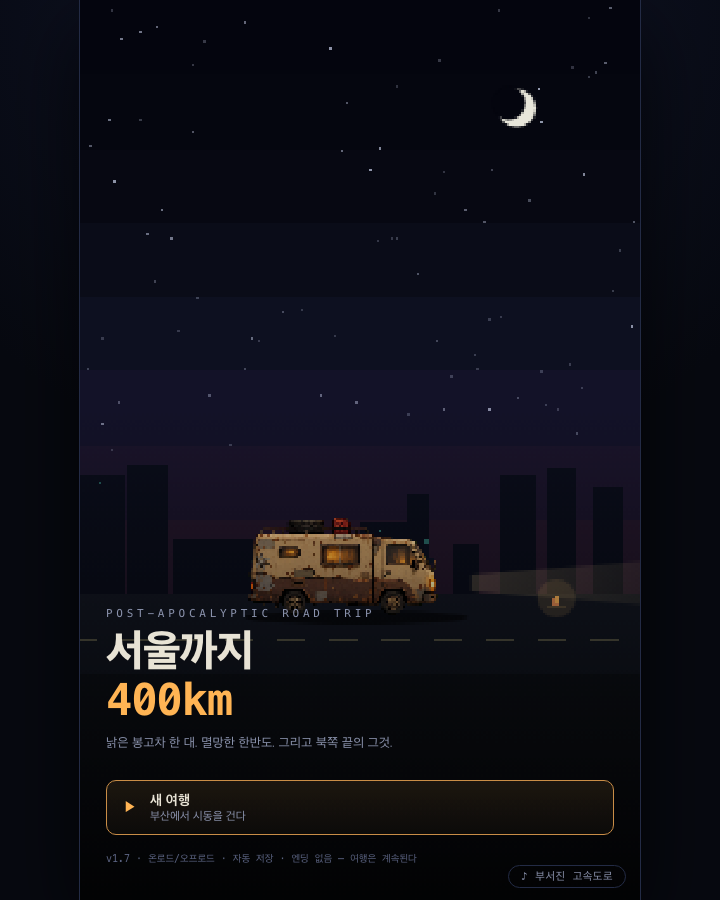
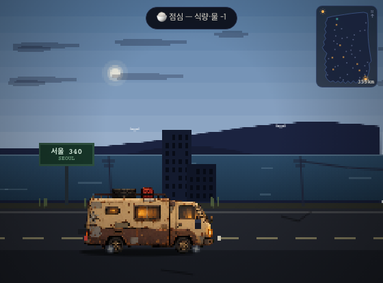
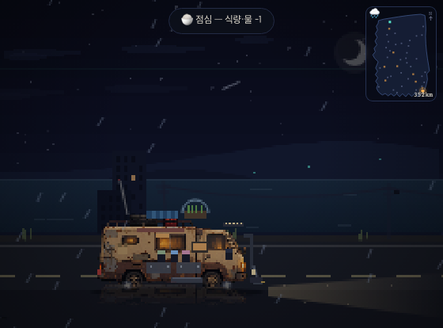
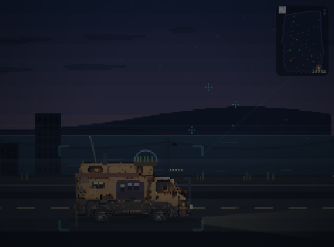
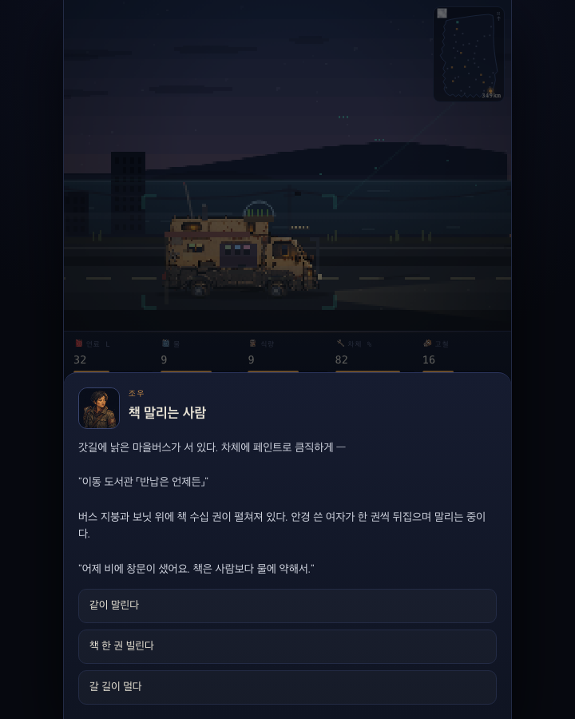
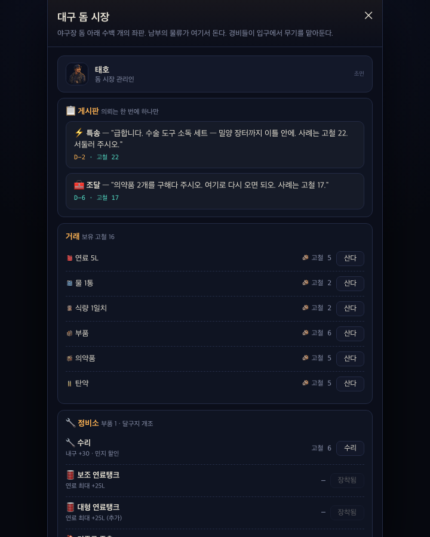

# 서울까지 400km 🚐

포스트아포칼립스 한국 로드트립 게임. 낡은 봉고차 '달구지'로 부산에서 서울 남산의 AI '천리안' 코어까지 411km.

> 143년 전, 통합 관제 AI **천리안**이 깨어나 첫 '정리'로 문명을 무너뜨렸다. 정리는 멈추지 않았다 — 세대마다, 구역마다, 조용하고 정중하게 돌아온다. 3년 전 봄, 우리 동네 차례였다.
> 감시는 중심(서울)일수록 촘촘하고 변방일수록 성글다. 천리안이 유일하게 못 보는 것 — 기록되지 않은 사람 사이의 유대와 기억. 그걸 싣고 온 자만이 남산의 문을 연다.

## ▶ 플레이

- **웹 (온로드 모드)**: https://twoinabillion.github.io/caravan/
- **로컬 (오프로드 모드 가능)**: `서울까지400km.html`을 브라우저로 열기
  - 오프로드 = 이벤트·대화를 LLM(claude-opus-4-8)이 실시간 생성 (Anthropic API 키 필요, localStorage에만 저장)
  - 아티팩트 호스팅은 CSP로 외부 API 차단 → 오프로드는 로컬 파일에서만

## 현황

| 영역 | 내용 |
|---|---|
| 이벤트 | **774종** (1:1·페어·티키타카 대화 158종 포함) · 잡담 237 |
| 지도 | 노드 58(강원 포함) + 안개, 도로 77 · 실제 남한 실루엣 |
| 동료 | 6명(+보리) · 유대·개인 서사·1:1 대화·페어 스토리 |
| 저항 연대망 | 지역별 6거점(해도·돔·솥·유령·산지기·이음망) — 관문의 '왜'를 서사화 |
| 여정 장부 | 서울은 과업 6개 완수해야 열림 → **서울 오르막 맵**(5정거장→코어=2막 문턱) |
| 밴 | 업그레이드 28종 트리(전부 외형+실효과) · 동료 좌석 2→3→4→5→6 단계 증설 |
| 전투 | 쇠파이프·석궁·화염병·탄약을 소비하는 이벤트 선택형 전투 |
| 시네마틱 | 도시 도착 9곳 · 회상/전투 사건 6연결 · 픽셀 장면 이미지 12종 |
| 세이브 | 여행 일지 = 지식 그래프([[링크]]) + .md 내보내기 |
| 오디오 | 「부서진 고속도로」 탑재 · BGM/보이스 파이프라인 배선 완료 |

의존성 0의 단일 HTML. 순수 Canvas 픽셀아트 렌더링.

## 개발

```bash
./build.sh              # src/ 파트 → 서울까지400km.html (파트 순서=로드 순서)
node tools/scan.js      # 정합성 스캐너 (이벤트 참조 전수 검사, 커밋 전 필수)
python3 tests/test_smoke.py   # Playwright 스모크
```

```
src/     01-style → 02-dom → 03-data → 03b-portraits → 03c-icons → 03d-bgm → 03e-van → 03f-npc-portraits
         → 04-engine → 05-scene → 06-mapgraph → 07-ui → 08-offroad → 09-close
docs/    DESIGN.md(디자인 바이블) · README · 오디오/보이스/노래 제작 시트
tools/   scan.js 정합성 스캐너
tests/   test_smoke.py
assets/  portraits·icons·audio 원본
```

설계 원칙·2막 떡밥·로드맵은 [docs/DESIGN.md](docs/DESIGN.md) 참고.

---

🤖 [Claude Code](https://claude.com/claude-code)로 개발 중

## 게임 장면

| 부산에서 출발 | 폐허가 된 도로 |
|:---:|:---:|
|  |  |
| **비 내리는 밤** | **천리안의 감시** |
|  |  |
| **길 위에서 만나는 사람들** | **생존자 정착지** |
|  |  |

낡은 봉고차 **달구지**를 고치고 확장하면서 부산에서 서울 남산까지 411km를 이동한다. 날씨와 시간대가 바뀌는 도로, 생존자들과의 선택, 동료 관계, 천리안의 추적이 하나의 여정을 만든다.
