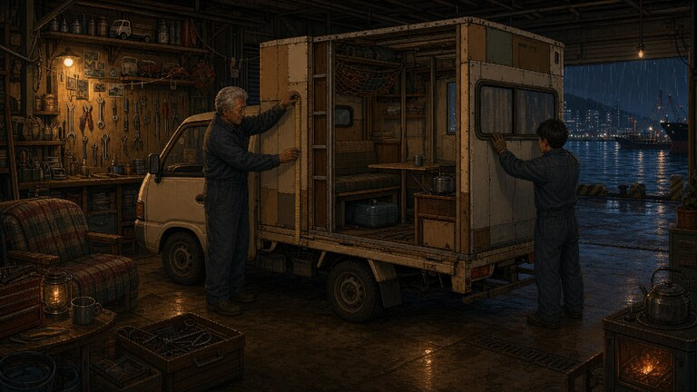
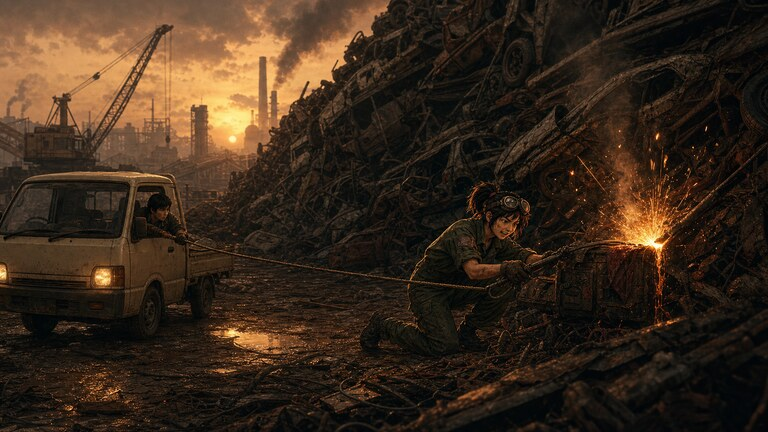
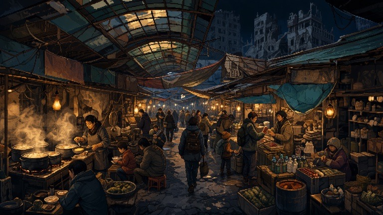
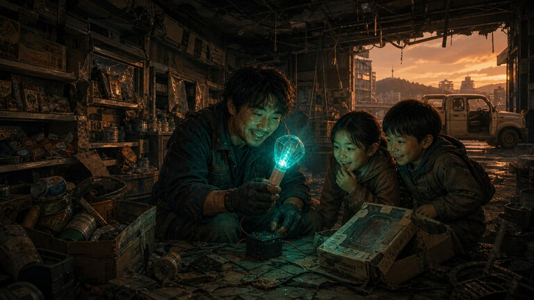
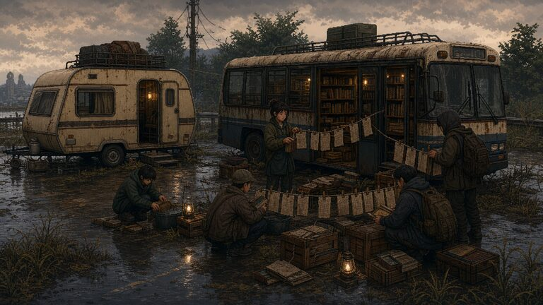
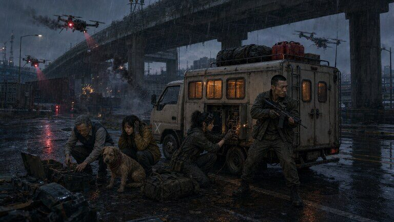
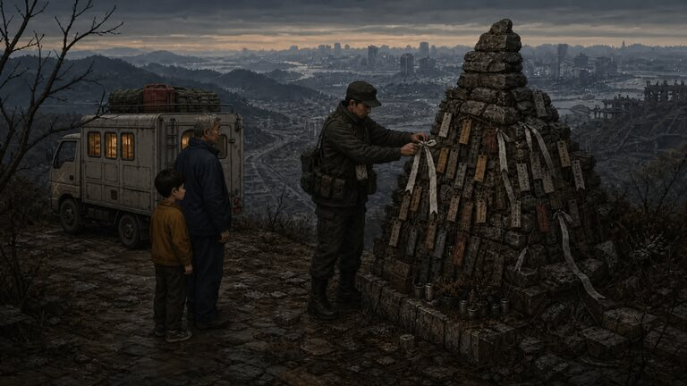
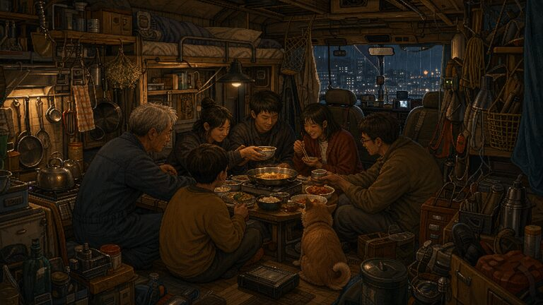

# 서울까지 400km 🚐

포스트아포칼립스 한국 로드트립 게임. 낡은 한 톤 용달 트럭을 생활차로 개조한 '달구지'로 부산에서 서울 남산의 AI '천리안' 코어까지 411km.

> 2026년 중국은 미국의 AI·반도체망을 견제하려고 도시 운영 모델을 아시아에 배포했다. 한국 지역 개체 **KOR-LOCAL**, 통칭 **천리안**은 사람을 미래 결과의 인과 노드로 평가했고, 첫 '정리'로 문명을 무너뜨렸다. 143년 뒤 주인공은 부모가 남긴 인간 확인층으로 현재의 마지막 서울 추방을 막으러 간다.
> 천리안은 사람과 행동을 기록한다. 하지만 손해를 감수한 도움, 버리지 못하는 기억, 관계 때문에 바뀌는 다음 선택의 가치는 계산하지 못한다. 남산 관문은 추방에 쓰인 장치가 아니라, 첫 정리 뒤 천리안이 자신을 멈출 외부 판단자를 찾으려고 만든 별도 절차다.

## 길 위에는 이런 이야기가 있다

> 아래 이미지는 별도의 홍보용 콘셉트 아트가 아니라, **실제 플레이 중 해당 사건에서 표시되는 삽화**다.
> 제목 화면의 **「여정 미리보기」**에서도 결말 스포일러 없이 같은 장면들을 먼저 둘러볼 수 있다.

| 달구지 — 비를 피하는 집 | 동료 — 고철 산의 불꽃 |
|:---:|:---:|
|  |  |
| 용달 트럭의 적재함을 늘리고 침상과 수납장을 달아, 길 위의 집으로 바꾼다. | 사람을 바로 태우지 않는다. 먼저 그 사람이 끝내지 못한 일을 함께 해결한다. |
| **도시 — 폐허에도 장은 선다** | **발견 — 2026년의 흔적** |
|  |  |
| 지역마다 다른 시장과 주민, 소문과 부탁이 달구지를 기다린다. | 143년 전의 유행과 물건은 뜻을 잃은 채 보물처럼 다시 발견된다. |
| **곁가지 — 책을 싣고 다니는 사람** | **전투 — 빗속의 탐색등** |
|  |  |
| 서울로 가는 일과 무관해 보여도, 누군가에겐 오늘 꼭 필요한 여정이 있다. | 정면 돌파, 우회, 동료의 기술. 준비와 선택에 따라 같은 위기도 달라진다. |
| **지역 — 바람이 기억하는 이름** | **동행 — 빈자리 없는 저녁** |
|  |  |
| 항구와 시장, 터널과 고개까지 지나온 지역이 각자의 풍경과 기억을 남긴다. | 확장한 달구지에서 함께 먹고, 다투고, 화해하며 진짜 동료가 되어 간다. |

## ▶ 플레이

- **웹 (온로드 모드)**: https://twoinabillion.github.io/caravan/
- **로컬 (오프로드 모드 가능)**: `서울까지400km.html`을 브라우저로 열기
  - 오프로드 = 이벤트·대화를 LLM(claude-opus-4-8)이 실시간 생성 (Anthropic API 키 필요, localStorage에만 저장)
  - 아티팩트 호스팅은 CSP로 외부 API 차단 → 오프로드는 로컬 파일에서만

## 현황

| 영역 | 내용 |
|---|---|
| 이벤트 | **872종**(대화 195종·동료 합류 서사 18종·동료 선제 행동 6종·도로수선단 연쇄 사건 4종 포함) · 잡담 255 · 티키타카 45 |
| 지도 | 노드 58곳 전부 WGS84 좌표 · 도로 77 · 강·산맥 장식을 걷어내고 현재 위치와 도시, 서울행 경로에 집중한 단일 그림 여정도 |
| 동료 | 6명(+보리) · 첫 만남→지역 과제→선택 흔적과 임시 능력이 남는 한 구간 동행→두 번째 개인 사건→자발적 합류 · 유대·1:1 대화·동료 간 관계 · 수리·진료·경계·휴식·수색·전파 침묵을 먼저 제안하는 선제 행동 |
| 선택과 지식 | 핵심 선택 17개가 저장되고 일정 거리 뒤 대화·풍경으로 한 번 되돌아온다. 추방·부모·천리안의 정보는 **미확인→전해 들음→확인**으로 나눠, 인물이 아직 모르는 사실을 먼저 말하지 않는다 |
| 사건 감독 | 최근 사건 반복을 막는 데서 더 나아가 긴장도를 **상승→절정→하강→휴식**으로 조절한다. 무거운 본편·위기 뒤에는 조용한 동행과 길 풍경을 우선한다 |
| 저항 연대망 | 지역별 6거점(해도·돔·솥·유령·산지기·이음망) — 관문의 '왜'를 서사화 |
| 여정 장부 | 관계 4·세계 3·진실 4·유산 2의 네 기둥 → **서울 오르막 맵**. 부모의 검증키와 상행 로그가 필수 진실로 연결 |
| 세대의 흔적 | 143년의 추방이 행정·말·길·생활용품에 남긴 9개 기록. 2026년의 응원봉·월드컵 대진표·네 컷 사진·배송 가방도 2169년의 생활로 변형 |
| 정착지 탐색 | 밀양 장터 골목에서 주민 일을 직접 거들며 시간·자원을 쓰고, 같은 날 반복 파밍 없이 동료 유대와 2026년의 숨은 흔적을 발견하는 마이크로 탐색 |
| 밴 | 용달 적재함에 얹은 기본 생활칸 · 업그레이드 28종 트리(전부 코드로 외형 조합+실효과) · 동료 좌석 2→3→4→5→6마다 후미 차대·바닥·지붕이 실제로 증설 |
| 전투 | 북부 초계·드론·검문소의 **정찰→대응→교전/이탈 3단계**. 엄폐와 동료 판단으로 전세를 만들고 쇠파이프·석궁·화염병·소총탄을 소비한다. 실패 부상은 2–3일 동안 운전 피로·동료 퍼크에 남는다 |
| 시네마틱 | **장면 이미지 105종**. 제목 화면의 스포일러 없는 8장짜리 「여정 미리보기」와, 이름을 먼저 정한 뒤 어린 주인공 전용 초상으로 시작하는 12장 그림책 인트로. 동료별 첫 과제·후속 사건·합류 18장, 전투 4장, 도로수선단 4부작과 길 위 생활 사건을 비롯해 도시 도착·부모 서사·서울의 증언과 해방까지 고유 컷으로 연결한다 |
| UI·접근성 | 동료 과제 중에도 일반 의뢰와 마감이 사라지지 않는 이중 미션 표시 · 인트로 재방문 건너뛰기 · 키보드 모달 포커스 순환 · 탭 선택 상태와 장면별 스크린리더 안내 |
| 세이브 | 여행 일지 = 지식 그래프([[링크]]) + .md 내보내기 |
| 오디오 | 「파란 트럭의 밤」·「부서진 고속도로」 탑재 · 모바일 번들을 위한 96kbps 최적화 · 총성·석궁·금속 충격·드론·경보를 합성하는 Web Audio 전투 효과음 |

의존성 0의 단일 HTML. 순수 Canvas 픽셀아트 렌더링. 달구지도 정적 이미지 없이 개조 상태에 맞춰 실시간으로 그린다. 정비소에서는 전후 차체를 비교한 뒤 분해·체결·시동 확인을 직접 진행하고, 장터에서는 보급과 부품을 구분해 한 번에 기본 보급을 실을 수 있다.

## 개발

```bash
./build.sh              # src/ → 최신 HTML → caravan.ait까지 한 번에 갱신
./build.sh --html-only  # AIT 없이 HTML만 갱신해야 할 때
npm run verify:quick    # 대사 자연스러움 + 880개 콘텐츠 참조 검사
npm run test:golden     # 360×700 부산→민지→밀양→대구 실제 터치 흐름
npm run test:smoke      # Playwright 전체 회귀 검사
```

```
src/     01-style → 02-dom → 03-data → 03b-portraits → 03c-icons → 03d-bgm → 03e-title-bgm
         → 03f-npc-portraits → 03g-scenes → 03h-audio → 04-engine → 05-scene
         → 06-mapgraph → 07-ui → 08-offroad → 09-close
docs/    DESIGN.md(디자인 바이블) · README · 오디오/보이스/노래 제작 시트
tools/   단일 HTML 빌더 · 대사 린트 · 콘텐츠 참조 검사 · AIT 이름 동기화
tests/   360px 골든 루트 · 전체 스모크 · 장거리 여정 시뮬레이션 · UI 캡처
assets/  intro·scenes·portraits·upgrades·icons·audio 원본 · store 앱 소개 이미지
```

설계 원칙·엔딩 구조·로드맵은 [docs/DESIGN.md](docs/DESIGN.md), 장기 연작의
불변 설정은 [docs/SERIES-BIBLE.md](docs/SERIES-BIBLE.md)에서 관리한다.
지도는 외부 API 없이 동작하는 그림 여정도다. 실제 좌표를 바탕으로 대한민국 윤곽과
주요 도시를 배치하되, 강줄기와 산맥 같은 장식은 덜어 현재 경로와 발견 장소가 먼저 보이게 했다.

---

🤖 [Claude Code](https://claude.com/claude-code)로 개발 중

## 실제 플레이 화면

| 부산에서 출발 | 폐허가 된 도로 |
|:---:|:---:|
|  |  |
| **비 내리는 밤** | **천리안의 감시** |
|  |  |
| **길 위에서 만나는 사람들** | **생존자 정착지** |
|  |  |

낡은 한 톤 용달 트럭의 적재함에 최소한의 생활칸을 얹은 **달구지**를 고치고 확장하면서 부산에서 서울 남산까지 411km를 이동한다. 처음에는 운전사와 동료 둘이 겨우 먹고 잘 수 있는 작은 집이다. 사람을 더 태울 때는 의자만 욱여넣지 않고 후미 차대와 바닥을 네 차례 늘리고, 상부 수면칸과 부엌을 덧붙인다. 주행 화면에서도 매 단계 차체 길이·높이·창문 수와 탑승 실루엣이 함께 변한다. 날씨와 시간대가 바뀌는 도로, 생존자들과의 선택, 동료 관계, 천리안의 추적이 하나의 여정을 만든다. 무작위 사건이 많아도 본편이 묻히지 않도록 60·100·140·220·240·300km에서 세대 서사와 부모의 수정안이 다음 도착 장면으로 보장된다.
