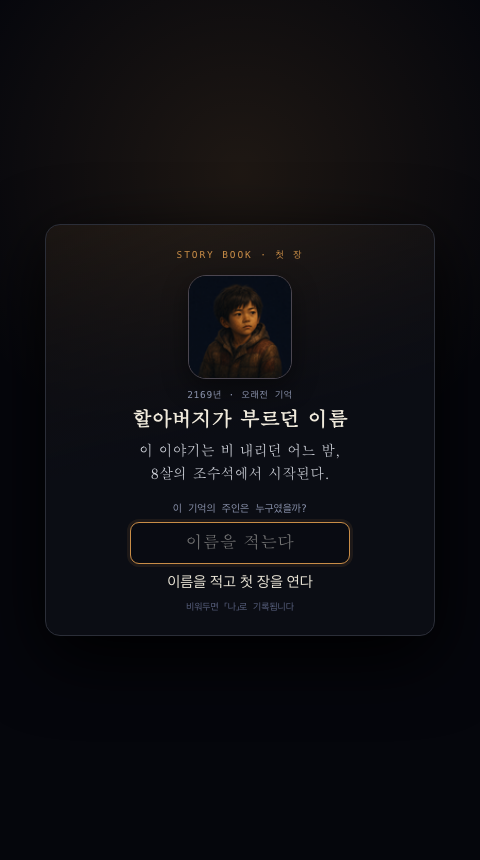
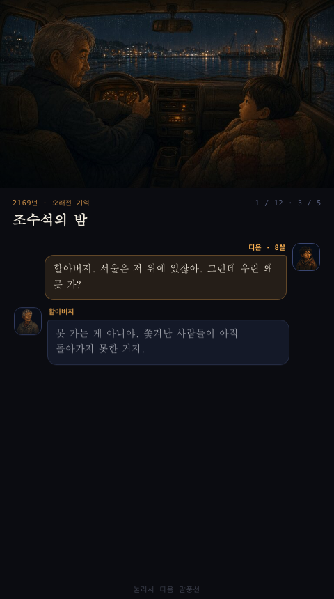
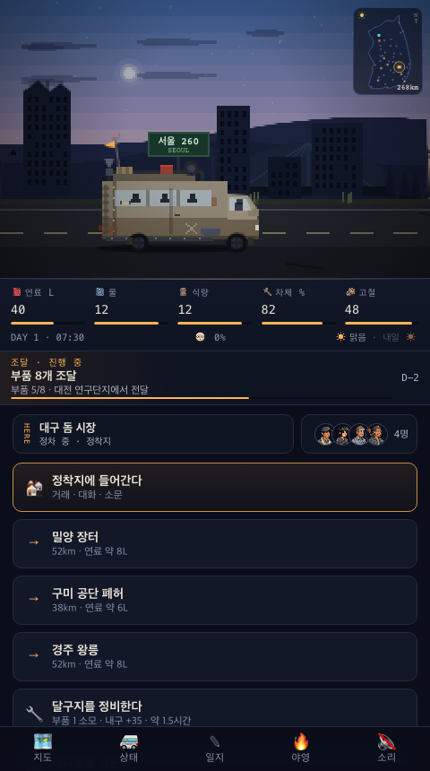
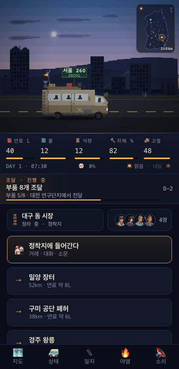
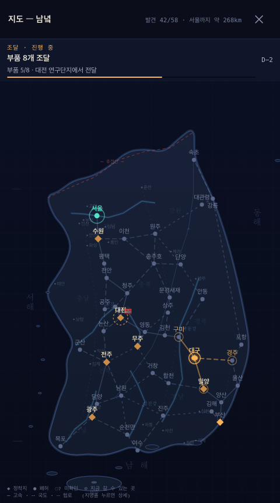
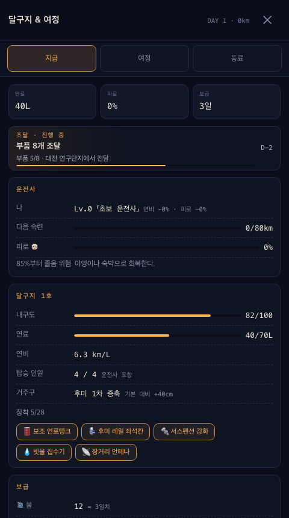
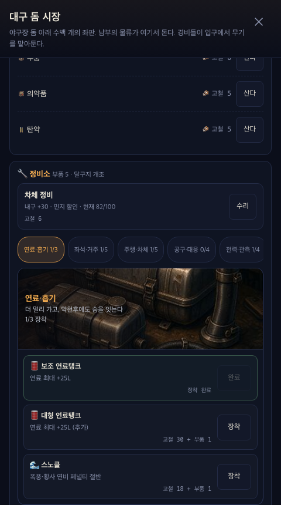
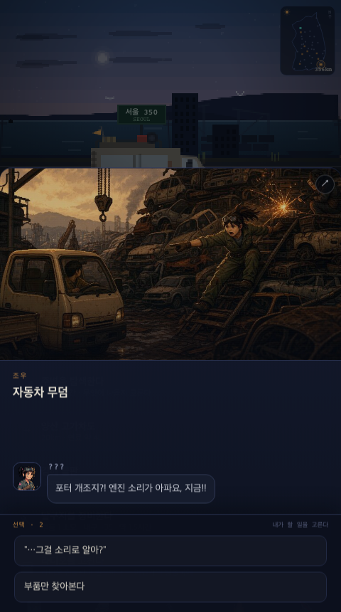
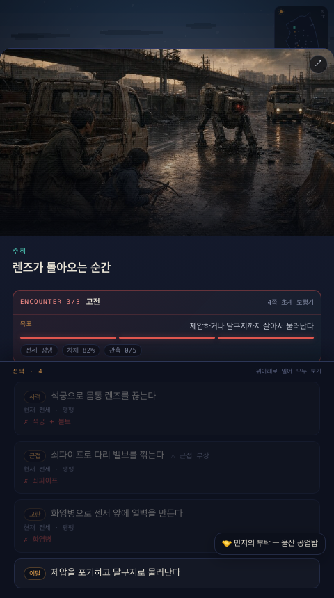
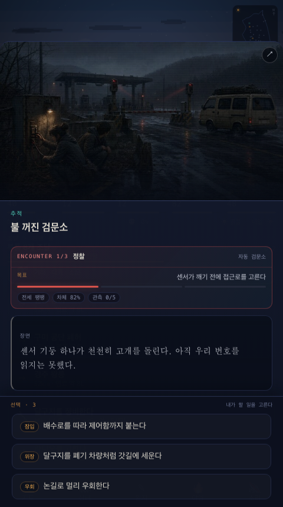

# 서울까지 400km — AIT 제작 전 통합 검수

검수일: 2026-07-28
기준 커밋: `f57573c feat: turn conversations into flowing chat` + 현재 수정본
모바일 화면: 480×860, 360×740

## 판정

**로컬 코드·웹 빌드·AIT 번들 기준 출시 차단 항목을 모두 수정했다.**

- 스토리·이벤트 참조·대화 화자·동료 합류 체인: 통과
- 자동 완주·세이브 마이그레이션·서울 결말 연쇄: 통과
- 메인 모바일 레이아웃·Safe Area·사운드 생명주기·AIT 직접 진입: 통과
- 실제 토스 앱의 iOS/Android QR 확인과 콘솔 아이콘 URL 게시만 외부 환경에서 남음

## 실제 화면 흐름

### 1. 이름 입력과 인트로 — 양호

- 어린 주인공 초상, `8살` 표기, 할아버지와의 화자 구분이 명확하다.
- 대화가 한꺼번에 쏟아지지 않고 턴별로 누적된다.
- 12장 전체 화면 인트로가 정상 진행된다.
- 서술 턴의 하단 절반 이상이 비어 보이는 장면은 리듬 조정 후보지만 출시 차단 문제는 아니다.

### 2. 메인 주행 화면 — 통과

- 480×860에서 `#main`과 하단 독의 하단은 모두 정확히 860px이며 본문은 90px 스크롤된다.
- 360×740에서도 하단 독의 하단은 정확히 740px이며 본문은 167px 스크롤된다.
- 지도·상태·일지·야영·소리 메뉴가 두 화면 모두 완전히 보이고 눌린다.

### 3. 지도 — 통과

- 360px에서는 보조 도시 라벨을 선별해 숨기고 주요 노드와 범례 크기를 올렸다.
- `SafeAreaInsets.get()/subscribe()` 결과를 CSS 변수에 연결했다.
- AIT 런타임에서는 미니맵·오버레이 헤더·확대 장면 버튼을 네이티브 X 아래로 내린다.

### 4. 상태·정비소 — 통과

- 상태는 `지금 / 여정 / 동료`로 나뉘어 정보 위계가 선명하다.
- 정비소 분류, 실제 부품 이미지, 장착 조건이 서로 잘 맞는다.
- 닫기·탭·정비 버튼의 터치 영역을 최소 44px로 맞췄다.
- `--dim`을 더 밝게 조정해 작은 보조 글자의 대비를 높였다.

### 5. 동료 대화·전투·선택지 — 통과

- 모르는 인물은 `???`로 표시하면서 얼굴은 보여 주어 의도가 잘 전달된다.
- 전투는 장면 이미지, 단계, 목표, 전세, 자원 조건이 한 화면에서 이해된다.
- 이벤트·전투·정착지·지도·상태 화면이 열리면 토스트가 숨는다.
- 두 해상도 모두 표시 중 토스트 0개, 선택지 겹침 0개로 측정됐다.

## 기능 및 정합성 결과

- `node tools/scan.cjs`: 이벤트 860종, 노드 58, 도로 77, 참조 오류 0
- `npm run lint:dialogue`: 대사 샘플 3,612줄, 자동 탐지된 몰입 파괴 항목 0
- `python3 tests/test_smoke.py`: 전체 통과, 콘솔 오류 0
- `python3 tests/capture_intro.py`: 12장 모두 내부 스크롤 없음
- `python3 tests/capture_ui.py`: 긴 사건 본문 114px, 선택지 51px 독립 스크롤
- `python3 tests/sim_full.py`: 12회 중 9회 6인 수원 도달, 2회 45일 초과, 1회 갈증 사망, JS 오류 0
- `npm run build:toss`: `caravan.ait` 정상 생성, appName `caravan`
- 새 AIT 압축 약 15MB, 압축 해제 약 38.4MB로 100MB 제한 이내

합류 과제 뒤 임시 동행으로 최소 하룻밤을 보내도록 보강했다. 자동 시뮬레이션의 평균 영입일은 민지 D2, 박 선생 D3, 재이 D5, 강우 D6, 레오 D24, 은수 D29로 초반 합류가 한 호흡씩 벌어졌다. 개인 과제를 마친 신뢰를 반영해 합류 시 유대 4로 시작한다. 자동 봇은 퍼크 선택을 하지 않으므로 레벨 수치는 실제 플레이와 동일한 밸런스 지표로 보지 않는다.

## 해결한 출시 차단 항목

1. `#scr-game` flex 축소·스크롤과 하단 독 위치 수정
2. 600×600 달구지 앱 아이콘 제작 및 `brand.icon` 설정
3. AIT `dist/index.html` 직접 진입으로 변경하고 `location.replace()` 제거
4. viewport 확대 방지·`viewport-fit=cover` 적용
5. `SafeAreaInsets` 연동과 네이티브 상단 버튼 회피
6. `visibilitychange/pagehide/pageshow`에서 저장·SFX·BGM·VO 정지/복귀
7. 공개 AIT에서 오프로드/API 키 UI 제거, 로컬 파일에서만 허용
8. 모달 중 토스트 숨김
9. 44px 터치 영역, 보조 글자 대비, 360px 지도 가독성 수정
10. 이름 단계 이후 깨졌던 인트로/UI 캡처 테스트 수정

## 실제 토스 환경에서 남은 확인

- `assets/app-icon.png`을 콘솔 또는 실제 공개 URL에 게시하고 현재 `brand.icon` URL이 접근되는지 확인한다.
- 생성된 아이콘은 600×600이며 설정 URL은 `https://twoinabillion.github.io/caravan/assets/app-icon.png`이다.
- `withBackButton`은 제거했고 내비게이션 테마는 dark로 설정했다.
- QR 테스트와 정식 출시 origin이 달라 테스트 세이브가 정식 환경으로 이어지지 않는다는 안내를 준비한다.
- 장치 변경까지 세이브를 유지하려면 로컬 저장 외 서버 저장 전략을 별도로 정한다.
- iOS/Android에서 네이티브 X·Dynamic Island·홈 인디케이터와 실제 간격을 QR로 최종 확인한다.

## 증거 한계

- 실제 토스 네이티브 내비게이션과 Dynamic Island는 로컬 Chromium 캡처에 나타나지 않는다.
- iOS/Android 백그라운드 사운드, 홈 인디케이터, 앱 종료 모달은 AIT QR 테스트에서 최종 확인해야 한다.
- 스크린샷만으로 스크린리더·키보드 전체 접근성을 보장할 수 없다.
