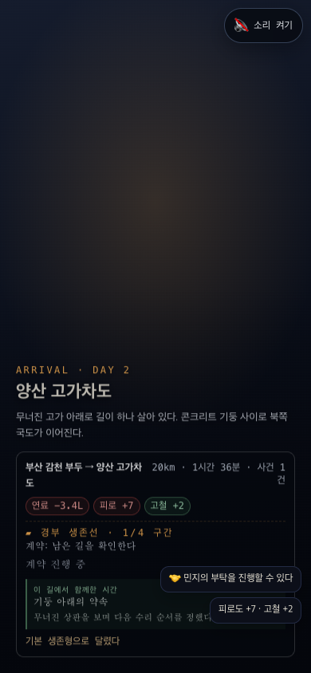
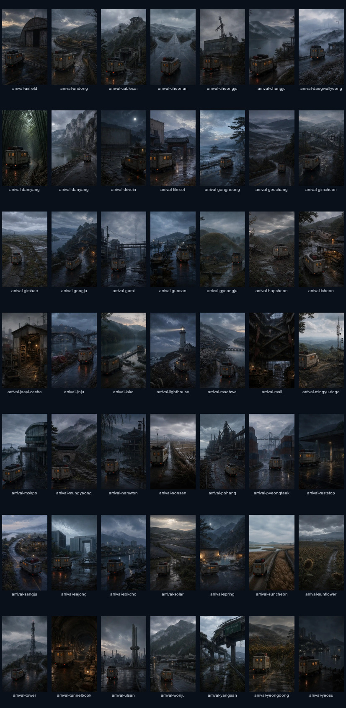
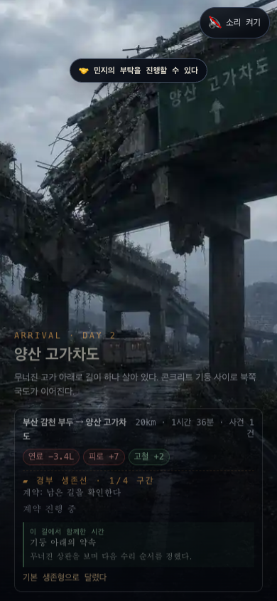
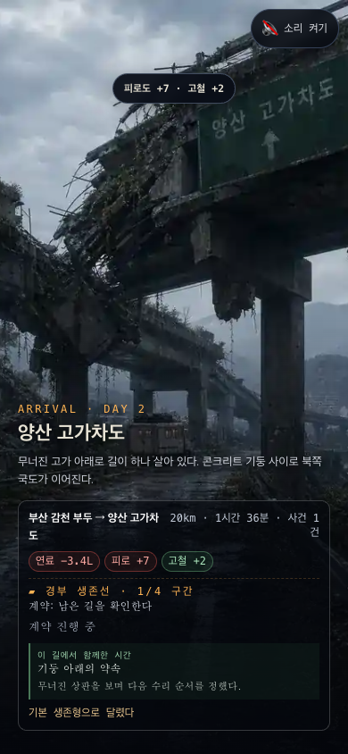
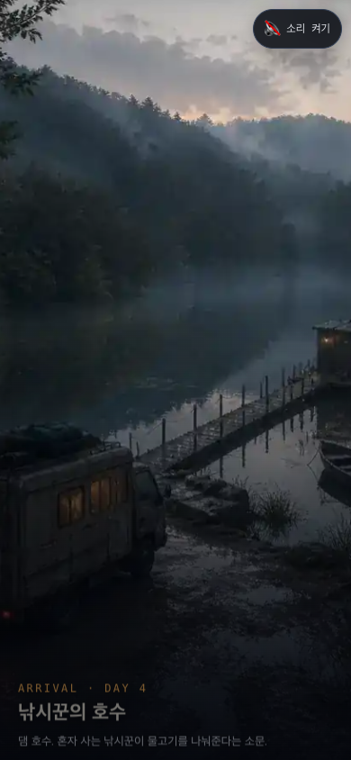

# 도착 장면·상태 알림 감사 · 2026-08-15

## 범위

- 흐름: 도로 주행 완료 → 장소 첫인상 → 주행 정산 → 부탁·자원 변화 알림
- 기준 화면: Chrome 모바일 `390×844`
- 접근성 목표: 장소를 이미지 없이도 식별하고, 상태 변화가 겹치거나 동시에 읽히지 않게 한다.

## 1. 변경 전 양산 도착 · 문제 있음

- 58개 노드 중 전용 도착 장면은 9개뿐이었다. 양산은 어두운 대체 배경만 표시했다.
- `민지의 부탁`, `피로 +7`, `고철 +2`가 하단 도착 정산을 덮었다.
- 장소 첫인상보다 숫자와 팝업이 먼저 보였다.

## 2. 신규 도착 장면 49개 전체 시트 · 양호

- 기존 전용 장면 9개와 합쳐 58개 도착 지점 전부가 실제 이미지를 갖는다.
- 장소별 지형 단서를 유지하면서 달구지 외형, 청회색 기후, 작은 주황 조명을 통일했다.
- 인물·위험·조우를 미리 보여주는 단서는 넣지 않았다.

## 3. 변경 후 양산 도착 · 양호

- 무너진 고가와 달구지가 먼저 읽힌다.
- 장소명·설명·주행 정산은 하단에 모이고, 부탁 알림은 상단의 고정된 한 자리에서 나온다.
- 장소 이미지는 장소명을 포함한 대체 텍스트를 갖는다.

## 4. 두 번째 상태 알림 · 양호

- 첫 알림이 사라진 뒤 `피로도 +7 · 고철 +2`가 같은 위치에 이어서 나온다.
- 동시에 두 알림이 쌓이지 않으며 하단 본문과 겹치지 않는다.
- `aria-live="polite"`, `aria-atomic="true"`인 단일 알림 영역에서 한 건씩 읽힌다.

## 5. 숨겨진 장소 도착 · 양호

- 주행 정산이 없는 경우에는 이미지·장소명·설명만 남겨 장소 풍경을 더 크게 보여준다.
- 숨겨진 장소도 일반 도시 컷을 재사용하지 않는다.

## 확인 한계

- 스크린샷은 화면 겹침과 시각적 위계만 확인한다.
- 실제 스크린리더 발화 순서와 색각 보조 환경은 별도 기기 검증이 필요하다.
