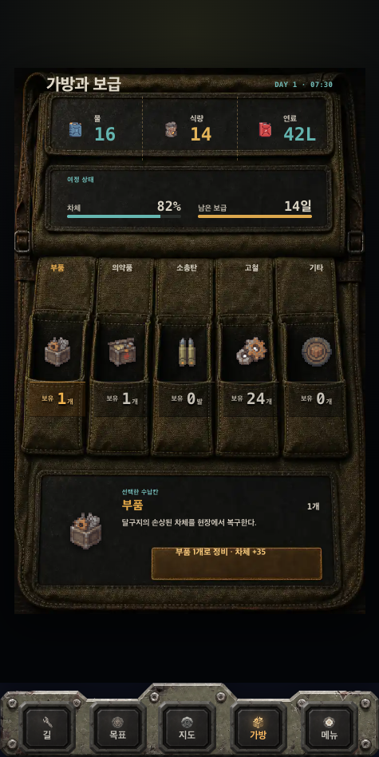
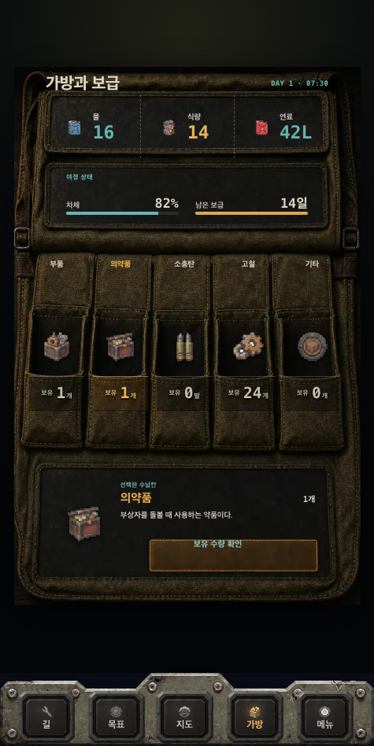
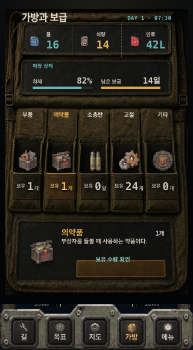

# 가방 UI 정밀 리뷰 — 2026-08-15

## 범위

- 대상: `서울까지400km.html`의 가방과 보급 화면
- 브라우저: Google Chrome
- 상태: 기본 부품 선택, 의약품 선택, 짧은 320×578 화면
- 확인 항목: 수납칸 정렬, 선택 상태, 상세 정보, 배경 이미지와 실제 버튼의 기하 일치, 짧은 화면 대응

## 전체 판단

큰 구조는 이제 안정적이다. 다섯 수납칸의 이름·아이콘·수량은 같은 축을 사용하고 있고 475px와 320px 모두 가로 오버플로가 없다. 다만 아직 완성도를 떨어뜨리는 문제가 세 가지 남아 있다.

1. 상세 영역의 실제 버튼이 배경 이미지에 그려진 버튼 홈보다 왼쪽·위쪽으로 넓게 잡혀 있어, 글자가 홈 한가운데에 놓이지 않는다.
2. 320×578에서는 가방 하단과 고정 내비게이션 사이로 뒤 화면이 얇게 노출된다.
3. 짧은 화면에서 수납칸 이름·`보유`·단위가 지나치게 작아진다.

## 단계별 증거

### 1. 기본 가방 — 양호, 상세 버튼 보정 필요

강점:

- 상단 자원 3칸, 여정 상태 2칸, 수납칸 5칸의 계층이 즉시 읽힌다.
- 수납칸 이름·아이콘·수량의 중심축이 일관된다.
- 선택한 `부품`은 이름 색, 밑줄, 수량 띠로 구별된다.
- 475×948에서 가로 오버플로와 브라우저 오류가 없다.

문제:

- 상세 버튼의 DOM 영역은 `x 152.8–400.3`이지만 배경에 그려진 버튼 홈은 눈으로 보아 더 오른쪽에서 시작한다. 그래서 `부품 1개로 정비 · 차체 +35`가 홈 중심보다 왼쪽·위쪽에 떠 보인다.
- 상세 설명과 버튼 글자가 상단 요약에 비해 한 단계 너무 작다. 선택 결과 영역이 보조 정보처럼 약해진다.

### 2. 의약품 선택 — 구조 양호, 행동 문구가 중복됨

강점:

- 선택 변경 시 이름, 아이콘, 수량, 설명이 함께 바뀌어 상태 연결은 명확하다.
- 선택된 `의약품`의 노란색과 밑줄이 다섯 칸 안에서 빠르게 보인다.

문제:

- `1개`가 수납칸, 상세 제목 우측에 이미 보이는데 큰 버튼이 다시 `보유 수량 확인`을 말한다. 행동처럼 보이는 큰 면적을 차지하지만 새 정보를 주지 않아 인터랙션의 의미가 약하다.
- 버튼 텍스트도 이미지 속 버튼 홈과 같은 중심을 사용하지 않아, 선택 상태를 바꿨을 때 정렬 불일치가 더 잘 보인다.

권장:

- 사용할 수 없는 상황이라면 `현재 사용할 대상 없음`처럼 상태를 설명하는 비활성 문구로 바꾸거나 버튼을 제거한다.
- 사용할 수 있는 상황이라면 `의약품 사용`처럼 실제 결과가 있는 행동만 버튼으로 둔다.

### 3. 짧은 휴대폰 — 사용 가능하지만 시각적 결함 있음

강점:

- 320px에서도 다섯 칸이 잘리지 않고 상세 버튼은 44px 높이를 유지한다.
- 가로 스크롤은 발생하지 않는다.

문제:

- 가방 프레임 아래와 하단 내비게이션 사이에 뒤 화면의 텍스트/선이 얇게 비친다. 작은 화면에서 가장 먼저 고쳐야 할 시각적 결함이다.
- 수납칸 이름과 `보유`, 단위가 약 10px 안팎까지 작아져 실제 휴대폰에서는 질감 위에서 읽기 어렵다.
- 상세 설명은 한 줄로 압축되고 버튼 문구와 간격도 촘촘해, 선택 결과가 한 덩어리로 보인다.

## 우선순위

- P1: 짧은 화면에서 뒤 화면이 비치는 하단 스트립 제거
- P1: 상세 버튼의 실제 클릭/텍스트 영역을 배경 버튼 홈에 맞춰 오른쪽·아래로 재정렬
- P2: `보유 수량 확인`을 실제 행동 또는 명확한 비활성 상태로 교체
- P2: 320px에서 수납칸 보조 글자와 상세 설명의 최소 크기 상향
- P3: 선택 강조 띠의 대비를 약간 높여 질감 위에서도 상태를 더 빨리 읽게 하기

## 접근성 위험과 확인 한계

- 전체 수납칸과 상세 버튼의 터치 영역은 충분해 보이지만, 작은 보조 글자와 낮은 회색 대비는 실제 기기에서 읽기 어려울 수 있다.
- 선택 상태는 색 외에 밑줄도 사용하고 있어 좋은 편이다.
- 이번 리뷰는 화면과 브라우저 동작 기준이다. 키보드 순서, 스크린리더 읽기, 실제 명암비 수치, 브라우저 상단바가 열린 실제 기기 상태는 별도 검증이 필요하다.

## 검증 기록

- 475×948 및 320×578 모두 수평 오버플로 없음
- 캡처 중 콘솔 오류 및 페이지 오류 없음
- 측정값: `metrics.json`
