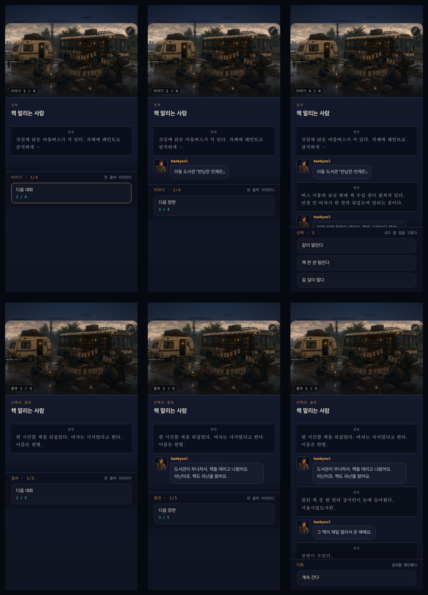

# 사건 진행 버튼 UX 리서치

검사 환경: AIT 런타임, 390×844 모바일 뷰포트, `책 말리는 사람` 사건의 `이야기 → 선택 → 결과 → 복귀` 흐름.

## 결론

내용은 읽기 좋지만, 진행 버튼을 담은 하단 영역이 고정되어 있지 않아 대화가 한 줄 추가될 때마다 아래로 밀린다. 사용자는 같은 행동을 반복하는데 엄지손가락의 목표 위치가 계속 바뀐다. `결과` 화면에서 같은 삽화를 새로 만들며 5.5% 확대하는 효과까지 겹쳐 실제 변화보다 화면이 더 분주하게 느껴진다.

이 문제는 `story-compact` 상태가 사건 본문을 내용 높이만큼만 사용하게 만드는 구조에서 발생한다. 현재 진행 버튼의 y 좌표는 이야기 522px → 559px, 결과 532px → 590px, 마지막 복귀 787px로 이동한다.

## 단계별 상태

1. 이야기 첫 턴 — 주의: 본문과 버튼은 명확하지만 버튼이 화면 중간 522px에 떠 있고 아래가 크게 빈다.
2. 이야기 다음 턴 — 문제: 대화 한 줄 때문에 같은 버튼이 37px 아래로 이동한다.
3. 선택지 — 보통: 선택 단계라는 변화는 분명하나 첫 선택지가 직전 진행 버튼과 비슷한 위치에 나타나 연속 탭 오선택 위험이 있다.
4. 결과 첫 턴 — 주의: 사건과 같은 삽화를 다시 로드해 확대하면서 새 화면처럼 보이지만 실제로는 같은 장면의 연속이다.
5. 결과 다음 턴 — 문제: 같은 진행 버튼이 다시 58px 이동한다.
6. 결과 완료 — 주의: 복귀 버튼이 787px로 크게 이동하고 높이는 43px에 그친다.

## 비교 리서치

- Apple은 컨트롤을 일관되고 예측 가능한 위치에 두어 사용자의 맥락을 보존하라고 권한다. 현재 흐름은 동일한 진행 동작의 위치가 대사 길이에 종속되어 반대 방향으로 작동한다. <https://developer.apple.com/design/human-interface-guidelines/design-principles>
- Ren'Py는 대사 진행과 선택 메뉴를 별도 상태로 다루고, 대사가 끝났음을 알리는 click-to-continue 표시를 제공한다. 이 게임도 `읽기`와 `결정`을 시각적으로 분리하는 편이 맞다. <https://www.renpy.org/doc/html/screen_special.html>
- ChoiceScript의 기본 진행 문구는 짧은 `Next`, 장 경계는 `Next Chapter`이며 모바일 버튼 문구를 다섯 단어 이하로 권한다. 이 게임의 `다음 대화/다음 장면/다음 방송` 반복 변경보다 하나의 `계속`과 별도 진행률이 더 안정적이다. <https://www.choiceofgames.com/make-your-own-games/important-choicescript-commands-and-techniques/>
- Apple은 모바일 버튼의 권장 터치 영역을 44×44pt, Android는 48×48dp로 제시한다. 현재 단일 선택과 `계속 간다`는 43px 높이라 최소 48px로 올리는 편이 안전하다. <https://developer.apple.com/design/human-interface-guidelines/accessibility> · <https://developer.android.com/codelabs/starting-android-accessibility>
- W3C는 상호작용으로 생기는 불필요한 움직임을 제거하거나 끌 수 있게 하라고 안내한다. 시스템의 모션 감소 설정을 따르는 현재 처리 자체는 좋지만, 기본 상태에서도 같은 삽화의 재확대와 진행 버튼 이동은 없애는 편이 낫다. <https://www.w3.org/WAI/WCAG22/Understanding/animation-from-interactions>

## 권장 구조

### 1. 읽기 모드

- 삽화와 제목은 고정한다.
- 대화 기록만 가운데 스크롤 영역 안에서 누적한다.
- 하단 104px 영역을 화면 아래에 고정한다.
- 버튼 문구는 계속 `계속`, 오른쪽이나 보조 줄에 `2 / 5`만 표시한다.
- 실제 다른 이미지 키로 넘어갈 때만 120–180ms 크로스페이드를 사용한다. 같은 이미지는 확대하거나 다시 등장시키지 않는다.

### 2. 선택 모드

- `계속` 버튼을 선택지 목록으로 교체하되 패널은 아래에서 위로 자라게 한다.
- 직전 진행 버튼 자리에 첫 선택지를 그대로 놓지 말고 짧은 전환 또는 입력 잠금으로 연속 탭 오선택을 막는다.
- 제목은 `선택 · 3`보다 `어떻게 할까?`처럼 플레이어의 행동을 묻는다.

### 3. 결과 모드

- 별도 시스템 화면처럼 `선택의 결과`를 반복하기보다 `같이 말린 뒤`처럼 방금 고른 행동을 맥락으로 보여준다.
- 진행 버튼은 읽기 모드와 같은 위치·높이·문구를 유지한다.
- 마지막만 같은 자리에 `길로 돌아가기`처럼 목적지가 드러나는 문구를 쓴다.

## 접근성 및 확인 한계

화면상 터치 크기, 위치 이동, 정보 순서는 확인했다. 스크린리더의 실제 낭독 순서, 큰 글자 설정, 손가락 연속 탭은 별도 실기 테스트가 필요하다.
