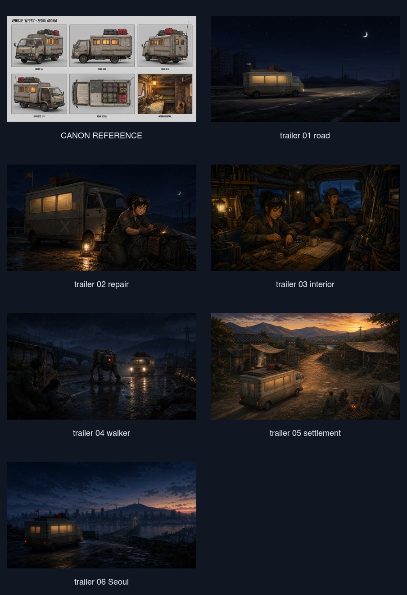

# 달구지 정본·모션 일치 감사 — 2026-08-11

## 결론

`/Users/sang/Downloads/dalguji_original.webp`를 정본으로 보면 현재 게임 이미지는 전반적으로 부합하지 않는다. 실시간 Canvas 달구지는 색, 흰 X, 지붕 짐, 빨간 제리캔을 가져와 가장 가까운 편이지만, 전면 캡과 생활칸이 일체형 RV처럼 붙고 옆창이 한 줄로 이어져 차량 구조가 다르다. 트레일러 모션용 시작 프레임도 같은 일체형 실루엣을 사용한다.

좋은 부분은 모션 방식이다. 차체의 무거운 바운스, 바퀴 회전, 헤드라이트와 도로 이동은 짐을 가득 실은 이동식 집의 무게를 전달한다. 움직임은 유지하고, 움직이는 차량의 도형만 정본에 맞춰야 한다.

## 정본 고정 요소

- 베이지·회색 국산 캡오버 트럭 전면
- 전면 캡과 분리되어 보이는 직사각형 박스 생활칸
- 생활칸의 독립된 주황색 창 세 칸
- 캡 측면의 흰 X
- 지붕의 검은 짐, 빨간 제리캔, 뒤쪽 안테나
- 후미 양문과 사다리
- 나무 바닥, 지도 테이블, 후미 침상, 벽 수납, 기타가 있는 따뜻한 내부

업그레이드는 이 요소를 바꾸지 않고 생활칸의 후미 길이와 내부 수납/침상만 늘려야 한다.

## 단계별 상태

### 1. 인트로와 사건 이미지 — 나쁨

- 인트로는 파란 1톤 캡오버 트럭이라 구조의 뿌리는 비슷하지만 색, X, 창, 지붕 짐이 다르다.
- 공용 사건·전투 이미지는 소형 승합밴을 사용해 차종 자체가 바뀐다.
- 동료 합류 뒤 내부 컷도 별도 박스 생활칸이 아니라 화물밴 뒷문 구조로 바뀌는 경우가 많다.

### 2. 실시간 주행 Canvas 외형 — 보통

- 일치: 베이지 상부, 어두운 하부, 지붕 스페어와 빨간 제리캔, 흰 X, 따뜻한 창, 안테나.
- 불일치: 캡이 너무 작고 생활칸과 붙어 일체형 RV로 읽힌다.
- 불일치: 옆창을 긴 직사각형 하나로 그린 뒤 선만 나눠서, 정본의 독립된 세 창과 다르다.
- 불일치: X가 생활칸 뒤쪽에 있으며 정본처럼 캡 측면에 고정되지 않는다.
- 불일치: 정본의 후미 양문, 사다리, 차대 구조가 주행 측면에서 충분히 읽히지 않는다.

### 3. 실시간 주행 모션 — 좋음

- 주행 중 두 축이 서로 다른 위상으로 바운스하고 바퀴가 회전한다.
- 정차 중에는 작은 아이들 모션만 남겨 무게감이 유지된다.
- 업그레이드에 따라 `bodyL`이 62→69→78→85→92로 길어지고, 생활칸 높이도 점진적으로 늘어난다.
- 이 모션 로직은 정본 차량의 도형으로 다시 그려도 그대로 재사용할 수 있다.

### 4. 트레일러 모션용 프레임 — 보통 이하

- 일치: 베이지/회색, 주황 창, 흰 X, 지붕 적재, 어두운 인디고와 따뜻한 내부 조명.
- 불일치: 대부분 짧은 보닛의 일체형 캠퍼밴/스텝밴이다. 정본의 국산 캡오버 전면과 분리된 박스가 아니다.
- 내부 분위기는 가깝지만, 정본의 후미 침상·지도 테이블·측면 창·기타 배치가 고정되어 있지 않다.
- 실제 움직이는 최종 InVideo 클립은 현재 연결에서 재생 프레임을 회수하지 못했다. 다만 입력 프레임과 기존 프롬프트가 다른 차량 기준이므로 정본 일치로 승인할 근거가 없다.

### 5. 업그레이드 방향 — 좋음

- 사람을 태울 때마다 차대를 후미로 늘린다는 서사는 정본과 잘 맞는다.
- 전면 캡, 휠베이스 기준, 도색, X, 기본 지붕 짐은 모든 단계에서 고정해야 한다.
- 창은 한 줄 유리가 아니라 독립 프레임으로 `2 → 3 → 4 → 4+상부창`처럼 늘리는 편이 정본을 유지한다.
- 내부는 같은 지도 테이블과 후미 침상을 유지하면서 좌석·수납·침상만 뒤쪽으로 추가해야 한다.

## 판정

현재 이미지는 **정본 불일치**, 실시간 외형은 **부분 일치**, 실시간 움직임은 **유지 가치가 높음**, 트레일러 모션 차량은 **재제작 필요**다.

## 증거 한계

- 저장된 트레일러 시작 프레임과 현재 렌더러 코드를 확인했다.
- InVideo의 실제 최종 영상 프레임은 현재 플러그인 한도/응답 문제로 직접 재생 검증하지 못했다.
- 이 감사는 차량 시각 연속성만 다루며 UI 접근성 판정은 포함하지 않는다.
