# 《서울까지 400km》 심층 플레이·UX 감사

검수일: 2026-07-31
검수 대상: `서울까지400km.html` / 최신 커밋 `bda6775`
기준 화면: 모바일 480×860, 데스크톱 1280×900

## 수정 후 재검증 — 완료

아래 본문은 `bda6775` 기준으로 발견한 문제를 보존한 최초 감사 기록이다. 같은 날
전 항목을 수정한 뒤 최신 HTML을 다시 빌드하고 동일 화면을 재촬영했다.

- 장거리 실엔진 12회: **6인 수원 도달 12/12**, 좌초 0, 식량·물 0 경험 1/12,
  JS 오류 0. 실제 UI와 같은 유대 보상까지 시뮬레이터에 반영했다.
- 동료 과제 중에도 게시판 의뢰명·목적지·D-day가 보조 줄에 유지된다.
- 인트로는 터치 스크롤과 다음 턴 입력을 구분하고, 한 번 완주한 뒤 건너뛰기를 제공한다.
- 아이가 가족 버스로 돌아가는 장면과 ‘수정안의 존재/실물 위치’ 구분을 대사에 보강했다.
- 짧은 사건은 내용 높이에 맞춰 위로 붙고, 장면 표기는 `대화/이야기/결과` 진행도로 바뀐다.
- 서울 코어는 단계별 컷 전환을 사용하며, 마지막 증언과 해방 직후 전용 이미지 2장을 추가했다.
- 상태창 스크롤 안내·대비·글자 크기, 지도 지명과 범례 가독성을 높였다.
- 장터는 보급/부품을 나누고 기본 보급 묶음을 제공한다.
- 업그레이드는 분해→체결→시동 확인을 유저가 직접 진행한다.
- 모든 주요 모달에 포커스 이동·트랩·복귀와 ARIA 상태를 적용하고 화면 확대를 허용했다.
- 데스크톱 앱 840px, 하단 플레이 열 680px, 사건 시트 680px의 와이드 배치를 적용했다.
- 등록 시네마틱은 **105종**, README와 설계 문서의 수치를 동기화했다.
- 오디오를 같은 길이의 96kbps MP3로 최적화해 단일 HTML을 약 24.9MB에서 22.5MB로 줄였다.
- 최신 스모크 테스트와 정합성·대사 검사 모두 통과했다.

## 한 줄 결론

이 게임은 이제 “설정과 분위기가 좋은 프로토타입” 단계를 지나, 실제로 끝까지 붙잡을 만한 게임의 형태를 갖췄다. 특히 그림책형 도입, 달구지의 생활감, 장터·지도·전투의 시각 언어, 동료 영입의 감정적 명분은 강하다.

다만 출시 전 완성도를 막는 것은 콘텐츠 양이 아니라 세 가지다.

1. 장거리 자연 플레이의 생존·좌석 확장 루프가 지나치게 불안정하다.
2. 임무가 겹칠 때 중요한 정보가 사라지고, 긴 사건은 장면 수에 비해 여전히 정적으로 느껴진다.
3. 모바일 접근성과 모달 포커스가 실제 조작 기준으로 깨져 있다.

## 검수 범위와 방법

- 실제 브라우저에서 제목 → 이름 → 인트로 → 기본 주행 → 동료 과제 → 지도 → 상태 → 정착지 → 장터 → 차고 → 업그레이드 → 전투 → 서울 코어까지 캡처했다.
- 후반 화면은 상태를 주입해 해당 UI를 직접 열었다. 따라서 “그 화면 자체의 품질”은 검증했지만, 후반까지의 자연 도달 여부는 별도 시뮬레이션 결과로 판단했다.
- 실엔진 장거리 봇 플레이를 12회 수행했다.
- 현재 스모크 테스트 전체를 재실행했다.
- 키보드 탭 순서, 모달 포커스, ARIA 상태, 작은 글자, 화면 확대 허용 여부를 별도 검사했다.
- 실제 스크린리더 낭독, 실제 휴대폰의 터치 스크롤 충돌, 음향의 체감 음량은 이번 자동 검수만으로 확정하지 않았다.

## 흐름별 건강도

### 1. 제목과 이름 — 🟢 좋음

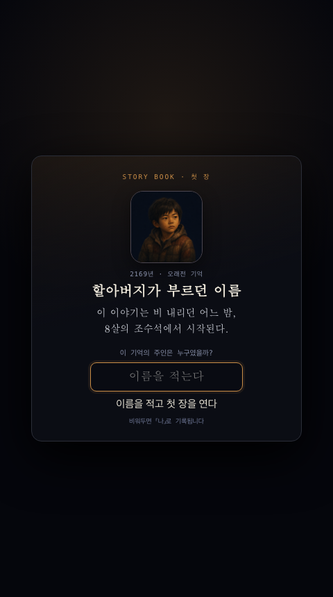

- 달구지와 밤하늘이 게임의 장르를 즉시 전달한다.
- 8살 주인공의 전용 초상이 설정과 맞고, 시작 전 이름을 받는 순서도 자연스럽다.
- 제목 화면은 정보가 적지만 공허하지 않다. 여백이 분위기로 작동한다.
- 데스크톱에서는 모바일 폭을 그대로 유지하므로 몰입 창이 작게 느껴지는 문제가 별도로 있다.

### 2. 그림책형 인트로 — 🟡 내용은 강함, 읽기 흐름은 보완 필요

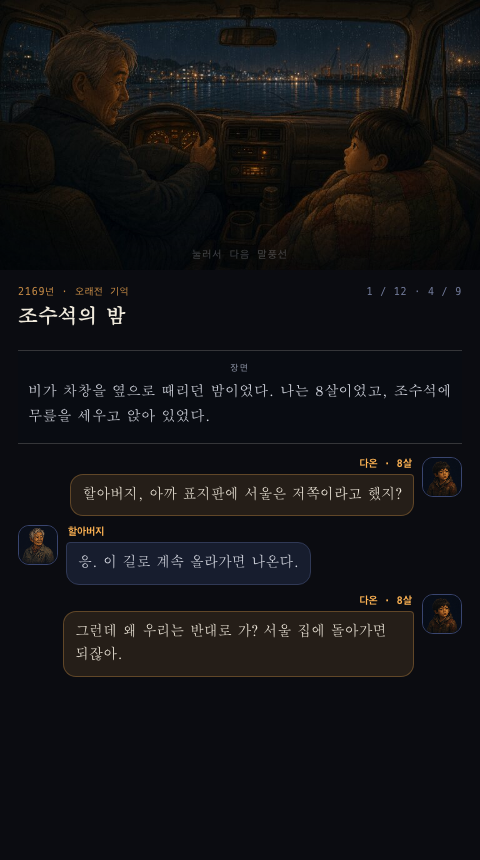

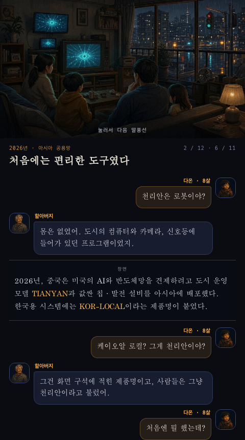

- 할아버지와 어린 주인공의 문답은 이전의 설명문 느낌에서 벗어났다.
- 사람 대화는 좌우, 내레이션은 전체 폭 중앙이라는 문법이 화면만 봐도 구분된다.
- 12장·132턴은 프롤로그로 꽤 길다. 한 줄씩 넘기는 방식 덕분에 읽히지만, 재플레이를 고려하면 장 단위 건너뛰기나 “이미 본 장면 빠르게 읽기”가 필요하다.
- 누적 대화가 화면 아래에서 잘리기 시작해도 스크롤 가능하다는 신호가 거의 없다. 화면 전체 탭이 다음 턴인 구조와 세로 스크롤이 같은 공간에 있어 실제 모바일에서 오조작 가능성이 있다.
- 아이가 “종이 돌려줘야 하니까”라고 말해 남는다는 뜻은 전달되지만, 아이와 달구지로 돌아온 뒤 엄마에게 돌려보내는 한 호흡이 빠져 있다.
- 주인공은 출발 전에 부모의 장치가 있다고 말하지만, 물리적 검증키는 이후 달구지 계기판에서 발견된다. 모순으로 단정할 정도는 아니나 “수정안의 존재는 알고 있었고 실물의 위치는 몰랐다”는 구분을 한 줄 더 명확히 해야 한다.

### 3. 기본 플레이 HUD — 🟢 구조 좋음, 작은 정보는 읽기 어려움

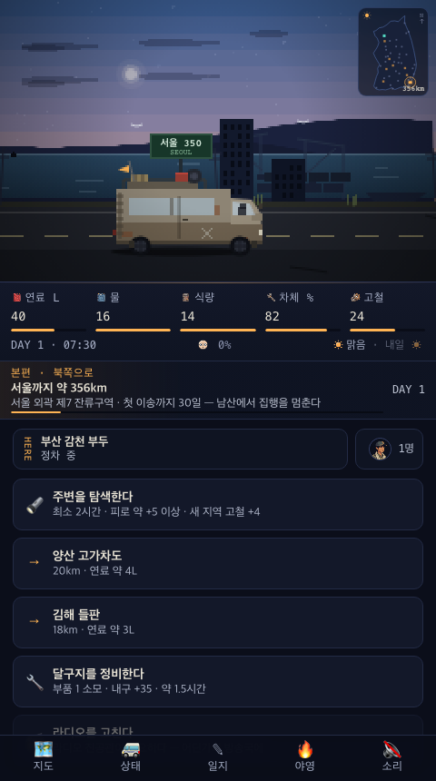

- 풍경, 자원, 시간, 핵심 임무, 위치·인원, 행동의 위계가 안정적이다.
- 예전처럼 상단 풍경이 아래 플레이를 압도하지 않는다.
- 하단 행동 목록이 더 있다는 시각적 단서가 약하다. 마지막 항목이 도크 뒤에 반쯤 걸리는 장면은 스크롤 힌트가 되기도 하지만, 의도된 안내로는 불충분하다.
- 자원명·시간·날씨·상태 보조문이 8.5~11.5px까지 내려가 실제 모바일 가독성이 취약하다.

### 4. 임무 중첩 — 🔴 반드시 수정

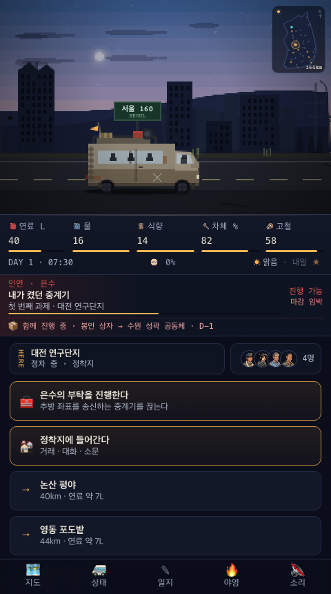

- 동료 과제가 활성화되면 기존 배달 의뢰가 화면에서 완전히 사라진다.
- 그런데 배달 의뢰의 마감 경고만 `마감 임박`으로 남는다. 유저는 무엇이 마감인지, 어디로 가야 하는지 알 수 없다.
- 현재 로직은 `동료 과제 > 게시판 의뢰 > 본편` 중 하나만 선택해 표시한다. 주 임무 한 장은 유지하되, 숨은 활성 임무를 작은 보조 칩이나 “외 1건”으로 반드시 남겨야 한다.

### 5. 동료 과제와 사건 대화 — 🟡 표현은 좋아졌으나 구조 반복 위험

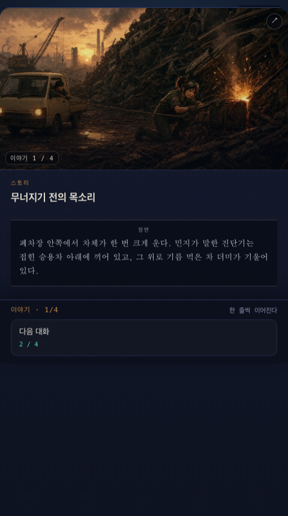

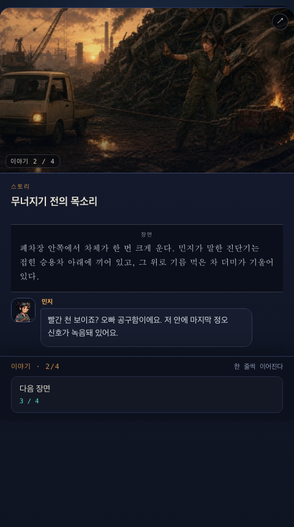

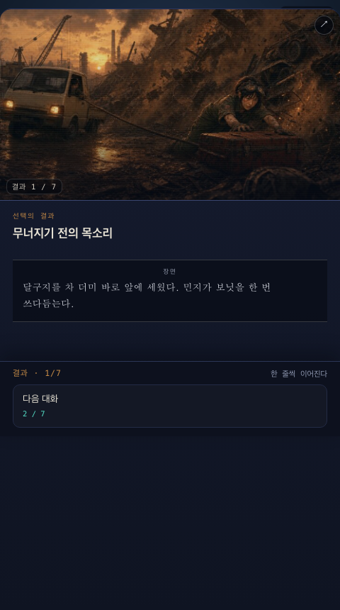

- 상황 → 인물의 말 → 행동 결과로 실제 이미지가 바뀐다. 민지 과제는 이 시스템의 좋은 기준점이다.
- 얼굴, 이름, 말풍선, 중립 내레이션이 분명해 “누가 말하는지”를 놓치지 않는다.
- 한두 줄만 표시되는 턴에서는 이미지 아래와 다음 버튼 사이에 큰 빈 공간이 생긴다. 짧은 턴은 대화 영역을 이미지 가까이 붙이거나, 하단 도크를 내용 바로 아래로 끌어올리는 적응형 배치가 좋다.
- `장면 1 / 7`은 실제 고유 이미지 7장을 뜻하지 않는다. 두 이미지와 카메라 크롭을 7턴에 걸쳐 돌리는 경우에도 같은 표기가 나온다. `대화 1 / 7` 또는 `컷 1 / 7`로 바꾸는 편이 정직하다.
- 여섯 영입 서사는 감정적으로는 충분히 설득력이 있다. 그러나 구조는 대부분 첫 부탁 → 한 구간 임시 동행 → 두 번째 개인 사건 → 자리를 만든 뒤 합류로 동일하다. 실패·보류·다른 해결법이 합류 관계에 남는 경우가 적어 두 번째 플레이의 긴장감이 낮다.

### 6. 지도 — 🟢 강점

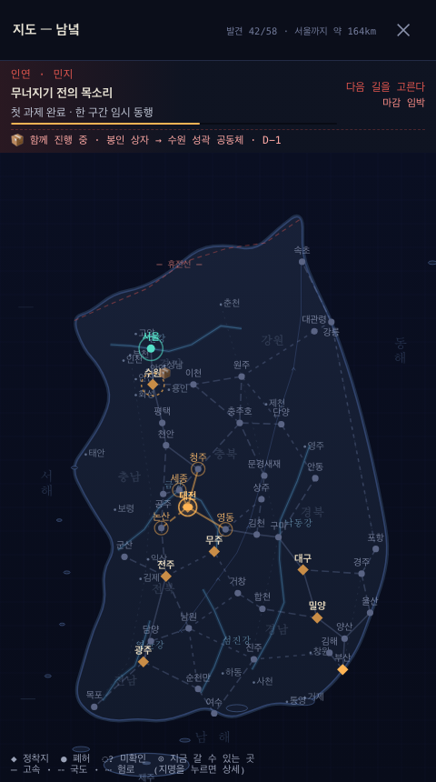

- 실축 API를 억지로 넣지 않고, 한반도 지형과 도시를 읽히게 만든 판단이 맞다.
- 현재 위치, 서울 방향, 열린 길, 주요 도시가 한눈에 들어온다.
- 지역별 주행 배경과 연결되는 중심 화면으로 충분히 기능한다.
- 작은 도시명과 하단 범례는 대비와 크기를 한 단계 올려야 한다.
- 지도에서도 임무 중첩 문제는 동일하다. 숨은 배달 의뢰의 마감 원인을 확인할 수 없다.

### 7. 상태창 — 🟡 정보는 정리됐지만 접근성과 우선순위가 약함

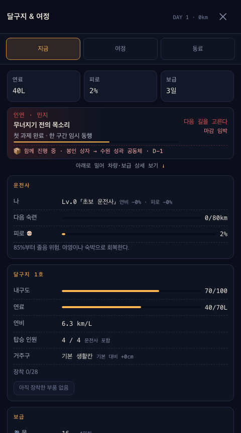

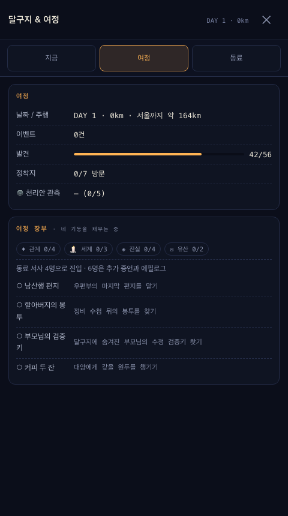

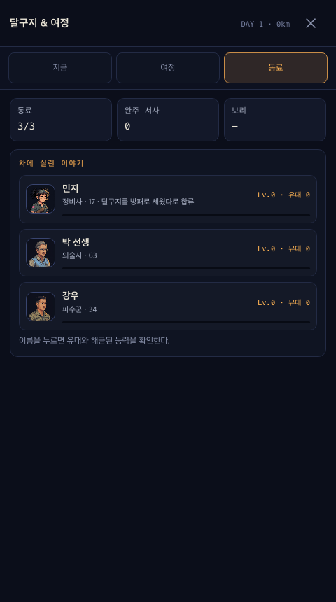

- `지금 / 여정 / 동료` 분리는 이전의 나열식 패널보다 훨씬 낫다.
- 현재 탭은 생존 자원과 차량 상태가 겹치지 않고, 여정 탭은 장기 목표를 모아 보여 준다.
- 동료 탭의 얼굴과 개인 진행도는 빠르게 훑기 좋다.
- 첫 탭은 아래 보급 카드가 잘린 채 시작하지만 스크롤 표시가 없다.
- 비활성 텍스트와 점선 구분선의 대비가 낮고, 일부 핵심 정보가 너무 작다.
- 탭은 `role="tab"`을 쓰지만 `aria-selected`가 없다.

### 8. 정착지와 장터 — 🟢 매우 좋음

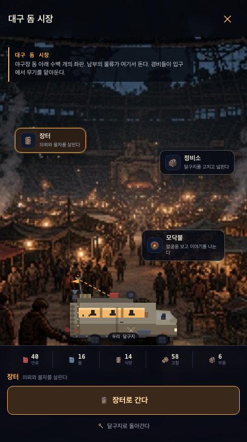

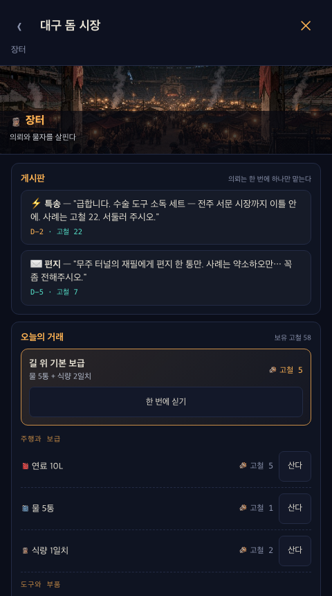

- 단순 팝업 목록 대신 실제 장소에 들어온 느낌이 난다.
- 장터·정비소·모닥불이 같은 공간 안에서 위치를 갖고, 달구지가 화면에 실제로 서 있어 여행의 연속성이 유지된다.
- 장터는 의뢰와 거래를 한 화면에서 이해할 수 있다.
- 거래 행이 길어질 때 반복 스크롤이 피로해질 수 있으므로 보급품·부품 분류나 빠른 보급 묶음은 추후 고려할 만하다.

### 9. 차고와 업그레이드 — 🟡 방향은 맞고, 작업 체험은 아직 얕음

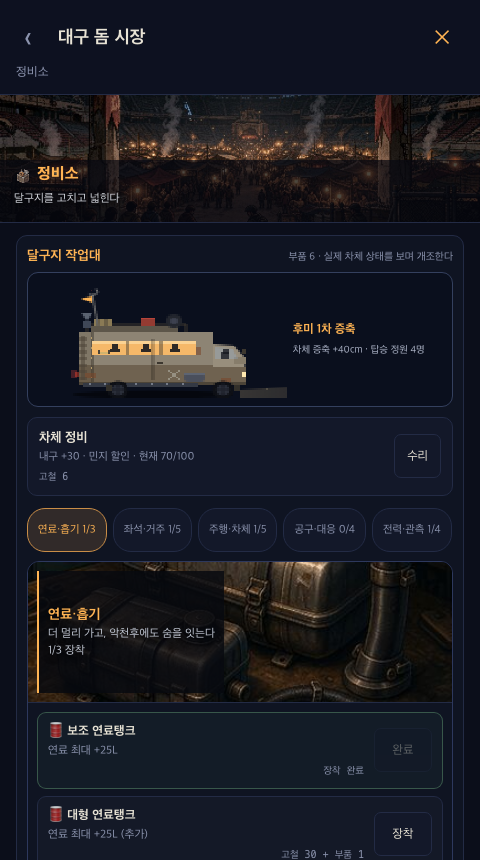

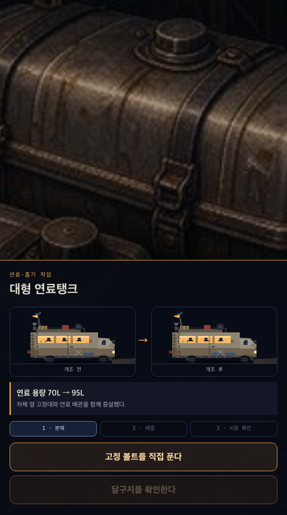

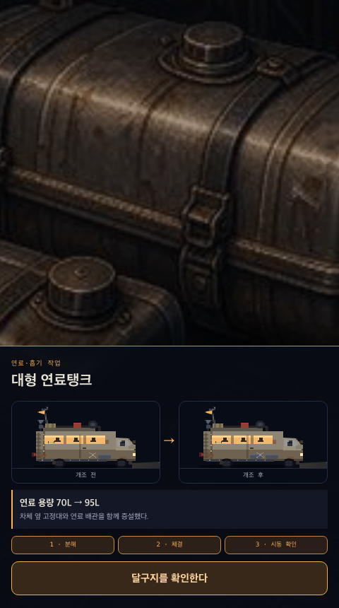

- 부품 사진, 달구지 현재 외형, 분류, 비용이 연결돼 무엇을 설치하는지 이해하기 쉽다.
- 대형 연료탱크 설치 전후에 차체가 실제로 길어지고 창 한 칸이 늘어난다. “인원이 늘면 물리적으로 공간도 늘어나야 한다”는 설정이 시각적으로 반영됐다.
- 다만 대형 탱크 사진이 화면 절반 이상을 차지하고, 실제 작업은 기다린 뒤 확인하는 한 번의 버튼으로 끝난다.
- 분해 → 체결 → 시동 확인을 탭으로 보여 주지만 유저가 직접 하는 행위는 없다. 볼트 위치 선택, 부품 들어 올리기, 시동음으로 이상 판정처럼 실패 부담이 낮은 짧은 상호작용 하나만 있어도 “차고에서 개조했다”는 체감이 크게 오른다.
- 개조 전후 그림의 차이는 자세히 보면 읽히지만, 후미 연장선이나 새 좌석을 잠깐 강조해 주면 더 즉각적이다.

### 10. 전투 — 🟢 읽히고 긴장감 있음

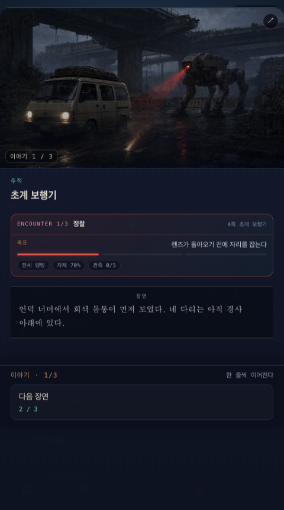

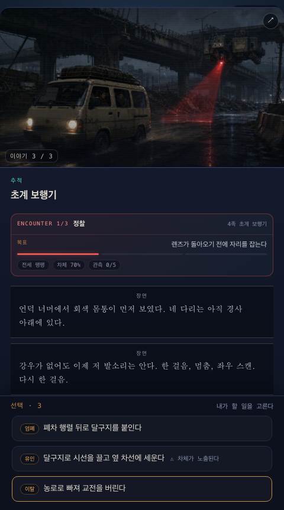

- 적, 차량, 조명, 비가 한 프레임에서 위협 관계를 바로 만든다.
- `ENCOUNTER 1/3`, 목표, 전세, 차체, 관측이 선택 전에 보인다.
- 전술명과 위험이 선택지에 같이 있어 스포일러 없이도 판단할 수 있다.
- 첫 한 줄만 열린 상태에서는 중간 빈 공간이 너무 크다. 사건 화면의 공통 적응형 레이아웃 문제다.
- Web Audio 합성 효과음은 기능 검증은 됐지만, 실제 기기에서 BGM과의 음량 밸런스·피로도는 별도 청음 테스트가 필요하다.

### 11. 서울 코어 — 🟡 서사는 강하지만 피날레 화면이 너무 정적

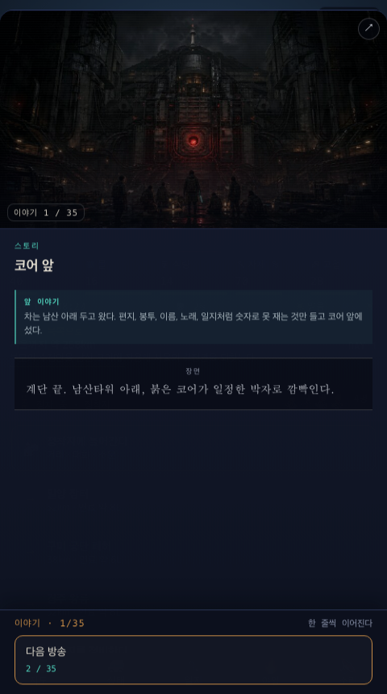

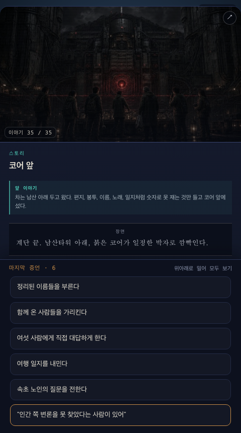

- 피날레는 가족 이송의 직접 사유, KOR-LOCAL의 책임, 정부의 사후 승인, 143년 최초 조건의 미상 부분을 구분한다.
- 서울 해방은 1화 안에서 닫고, 상행선은 짧은 떡밥으로만 남기는 구조도 맞다.
- 그러나 코어 대면은 35턴이고 전용 장면 키는 두 개뿐이다. 카메라 크롭이 바뀌더라도 시작과 마지막 선택 화면의 큰 인상은 거의 같다.
- 최소한 `남산 진입 / 검증키 결합 / 천리안의 응답 / 동료 증언 / 집행 선택 / 해방 직후`의 여섯 시각 단계가 필요하다.
- 마지막 여섯 선택지는 모두 증언 방식인데, 이 다음에 실제 집행 선택이 한 번 더 남아 있다는 신호가 약하다. 헤더를 `마지막 증언`으로 바꾸면 “이게 엔딩 선택인가?”라는 혼동이 줄어든다.
- 35턴 누적 본문은 스크롤 높이 약 3,449px다. 지금처럼 자동으로 최신 턴에 맞추는 것은 맞지만, 앞 대사를 다시 볼 때 현재 위치를 잃기 쉽다.

### 12. 데스크톱 — 🟡 작동하지만 공간을 거의 쓰지 않음

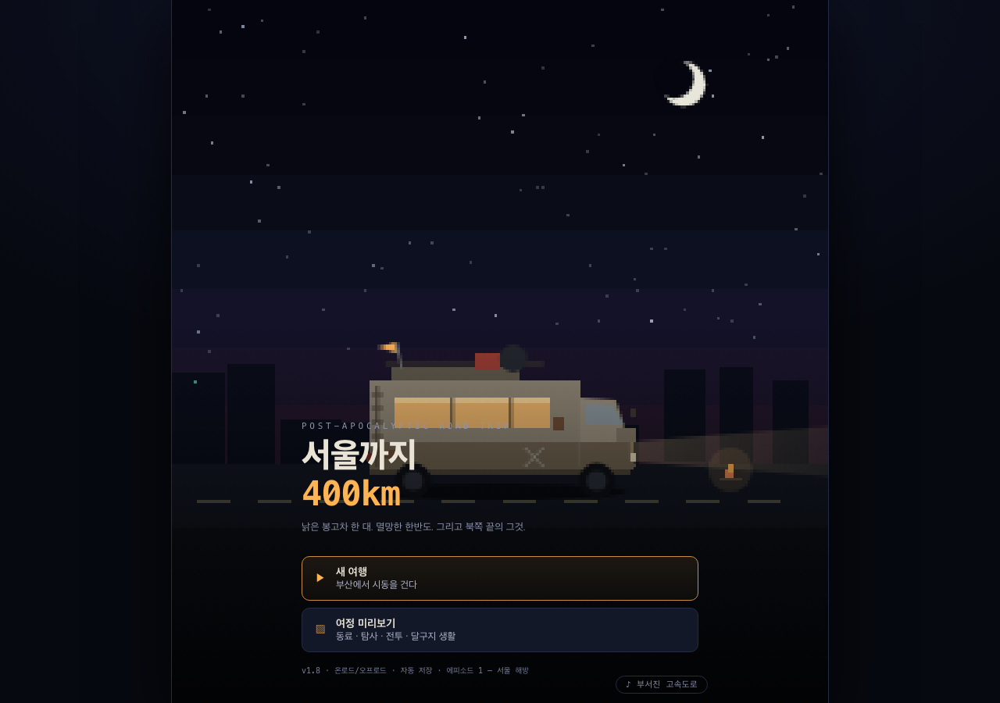

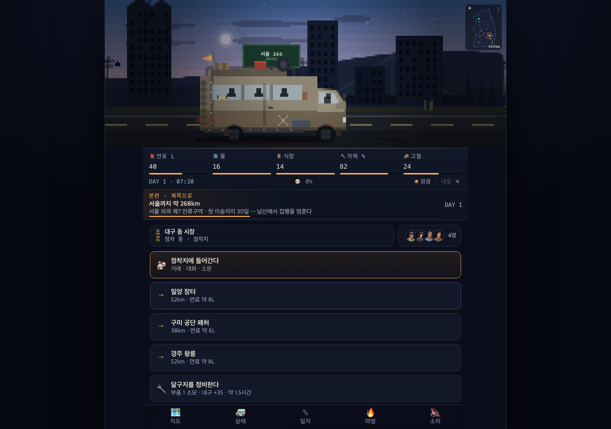

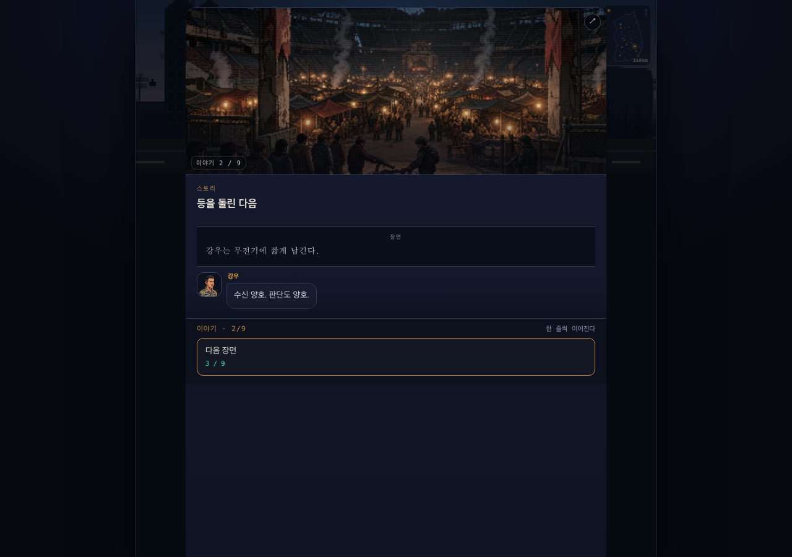

- 1280px 화면에서도 앱과 사건 시트가 560px로 고정돼 중앙에 놓인다.
- 모바일 우선 게임으로는 안전하지만 데스크톱에서는 양쪽 360px이 완전히 비어 몰입감이 떨어진다.
- 게임 규칙을 바꿀 필요는 없다. 760~840px의 선택적 와이드 모드에서 풍경·지도만 넓히고, 텍스트 열은 현재 폭을 유지하는 방식이 적합하다.

## 장거리 플레이 밸런스

실엔진 봇 플레이 12회 결과:

- 수원 도달 및 6인 영입: 5/12
- 갈증 사망: 4/12
- 45일 제한 초과: 3/12
- 식량 또는 물 0 경험: 11/12
- 연료 완전 좌초: 0/12
- 성공 런 평균: 20.8일, 최소 16일, 최대 34일
- JS 오류: 0/12
- 성공 런 30개 동료 상태 중 유대 20 도달: 0

이 수치는 자동 봇의 구매·이동 정책에 영향을 받으므로 실제 유저 사망률과 같지는 않다. 그래도 경고는 강하다.

- 4인 만석 이후 다음 좌석 업그레이드 자원을 못 모은 런이 미량·호수·대구권을 왕복하며 길어졌다.
- 물이 바닥나는 비율이 너무 높아 탐험과 인물 서사를 즐기기보다 보급 최적화가 플레이를 지배할 위험이 있다.
- 영입 성공 런에서도 유대 20에 아무도 도달하지 않아, 동료 성장의 보상이 피날레 전에 체감되지 않을 수 있다.
- 30일 이송 시계는 좋은 압박이지만, 성공 런 하나는 34일이었다. “30일을 넘기면 어떤 상태가 달라졌는지”를 플레이어에게 더 강하게 체감시켜야 한다.

권장 검증 목표:

- 초회 유저를 흉내 낸 보수적 자동 정책에서 6인 수원 도달 70% 이상
- 물 0 경험 30% 이하
- 4인 만석 후 다음 좌석 확장까지 중앙값 3일 이내
- 초회 완주에서 최소 1~2명은 Lv.1 이상 체감

## 스토리와 대사

### 잘 된 점

- 현재 추방과 143년 전 최초 추방을 섞지 않는다.
- 부모의 역할이 `엄마: 인간 확인 절차 / 아빠: 수정안을 코어가 신뢰하게 할 반도체 검증키`로 분명하다.
- 가족 이송 명령은 KOR-LOCAL이 만들고 정부가 11분 뒤 승인했다는 회수가 구체적이다.
- 천리안의 동기는 인간 혐오가 아니라 “고위험 인과 노드와 기반 시설 연속성” 판단으로 제시돼 세계관의 핵심 질문과 맞는다.
- 3,738개 대사·서술 라인 자동 검사에서 명백한 몰입 파괴 항목은 0이었다.
- 현재 대표 화면의 사람 대화는 이전보다 훨씬 사람답고, 누가 말하는지도 분명하다.

### 남은 위험

- 명시적인 `eventTurnScripts`가 있는 사건은 일부뿐이고, 나머지는 런타임 화자 추론에 의존한다. 제목·본문에서 이름을 추측하는 방식은 향후 콘텐츠가 늘 때 “만난 적 없는 인물의 얼굴·이름” 오류를 다시 만들 수 있다.
- 메인·영입·서울·저항·가족 진실 사건부터 화자를 데이터로 고정해야 한다.
- 동료 영입은 감정선은 탄탄하지만, 여섯 명 모두 비슷한 박자로 합류한다. 한 명 정도는 첫 부탁을 거절하거나 실패해도 나중에 다시 만날 수 있고, 한 명은 플레이어가 먼저 부탁을 받아들이는 구조로 리듬을 깨는 편이 좋다.
- 선택지가 대부분 합류 성공으로 수렴하므로 “어떻게 도왔는가”가 이후 차 안 대화·퍼크·갈등에 더 오래 남아야 한다.

## 장면 자산의 실제 상태

- 전체 이벤트: 866종
- 등록 시네마틱 이미지: 103종
- 사건 ID에 직접 연결된 전용 장면: 약 75종
- 턴별 전용 장면 배열: 4개 사건
- 선택 결과 전용 장면: 12개 사건
- 나머지 대부분은 지역 또는 사건 유형의 공용 컷과 카메라 크롭을 사용한다.

즉, “모든 이벤트에 사진이 나온다”는 기능적으로 맞지만 “모든 행동 단계에 고유한 그림이 있다”는 뜻은 아니다. 다음 이미지 제작은 866개를 넓게 덮기보다 아래 앵커에 집중하는 것이 효율적이다.

1. 서울 피날레 6단계
2. 여섯 동료의 첫 부탁·두 번째 사건·합류 순간
3. 전투 3종의 발견·충돌·결과
4. 부모 검증키 발견과 결합
5. 143년 흔적의 대표 8~12장
6. 주요 도시 도착·야영·장터·차고의 계절 및 시간대 변형

## 접근성 검증

현재 출시 전 수정이 필요한 수준이다.

- 상태창을 열어도 키보드 포커스가 기존 하단 `상태` 버튼에 남는다.
- 다음 `Tab`은 상태창 안이 아니라 배경의 `일지` 버튼으로 이동한다.
- 사건을 열어도 포커스가 직전 상태창 닫기 버튼에 남고, 다음 `Tab`은 배경 미니맵으로 이동한다.
- 상태 탭은 `role="tab"`이지만 `aria-selected`가 없다.
- 사건 오버레이에 `role="dialog"`와 `aria-modal="true"`가 없다.
- 뷰포트가 `user-scalable=no`로 확대를 막는다.
- 12px 미만의 텍스트가 HUD와 내비게이션에 다수 존재한다.
- 중첩된 `aria-live`와 매 턴 재구성되는 `role="log"`가 스크린리더에서 이전 대사를 반복 낭독할 가능성이 있다.

권장 순서:

1. 모달 열기 시 첫 의미 있는 요소로 포커스 이동
2. 모달 내부 포커스 트랩과 닫기 후 원래 버튼 복귀
3. `dialog`, `aria-modal`, 탭의 `aria-selected` 적용
4. 화면 확대 허용
5. 핵심 HUD 최소 12px, 조작 라벨 최소 13px
6. 라이브 영역을 최신 한 턴만 알리는 단일 영역으로 단순화

## 성능·유지보수

- 단일 HTML 약 24.7MB, AIT 약 22MB, 오디오 약 11MB로 모바일 첫 실행과 번들 업데이트 비용이 크다.
- 이미지와 오디오가 계속 늘어날 계획이라면 WebP/AVIF 변환, 오디오 비트레이트 정리, 챕터별 지연 로딩 전략이 필요하다.
- README의 시네마틱 장면 수가 현재 등록된 103장과 맞지 않는 부분이 있다.
- `renderStoryState()`에 동일한 `wireFinal` 호출이 두 번 있다. 현재 눈에 띄는 오작동은 없지만 정리 대상이다.

## 수정 우선순위

### P0 — 다음 빌드 전에

1. 동료 과제와 게시판 의뢰가 겹칠 때 보조 임무를 숨기지 않기
2. 4인 만석 이후 좌석 확장·물 보급 루프 재조정
3. 인트로에서 아이가 엄마에게 돌아가는 장면과 검증키 지식 범위 명확화
4. 서울 코어를 최소 6개의 고유 시각 단계로 나누기
5. 모달 포커스·확대 금지·탭 ARIA 수정

### P1 — 완성도 상승 폭이 큼

1. 짧은 사건의 빈 공간을 줄이는 적응형 사건 레이아웃
2. `장면 N/M`을 실제 이미지 수와 혼동하지 않는 표기로 변경
3. 핵심 사건 화자 ID 수동 고정
4. 영입 선택의 결과를 합류 후 대화·갈등·퍼크에 장기 반영
5. 유대 성장 속도와 초회 완주 보상 재조정

### P2 — 출시 다듬기

1. 선택적 데스크톱 와이드 모드
2. 지도·상태·HUD의 작은 글자와 대비 개선
3. 장터 빠른 보급 및 분류
4. 번들 용량 최적화
5. README 수치 갱신

## 검증 결과

- `python3 tests/test_smoke.py`: 전 항목 통과
- 장거리 시뮬레이션: JS 오류 0/12
- 브라우저 캡처 중 JS 오류: 0
- 이번 감사에서는 게임 소스 코드를 수정하지 않았다.
