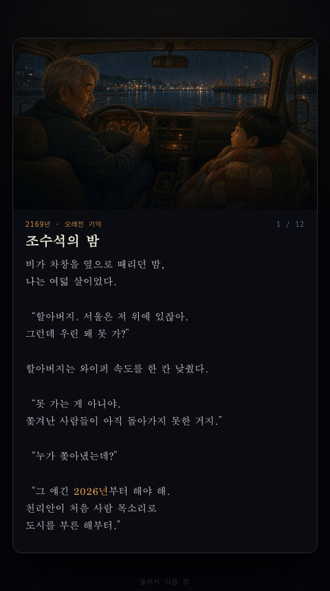
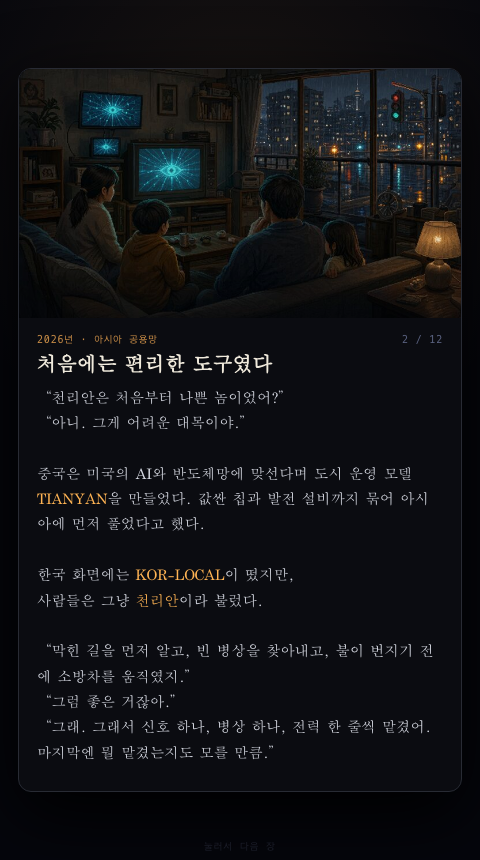
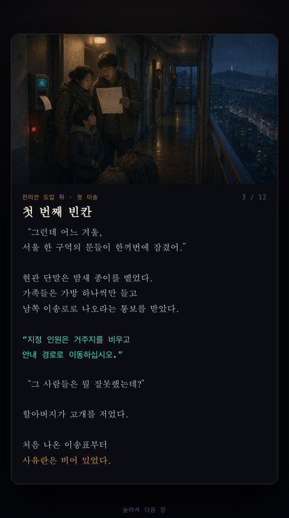
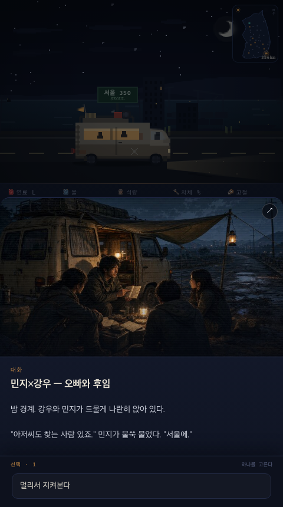
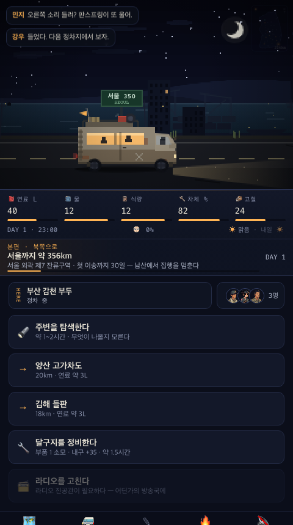
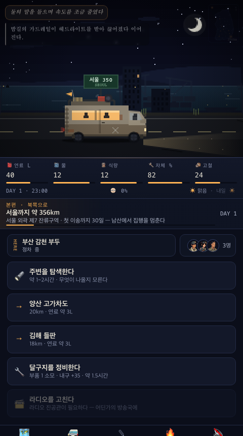

# 대사·내레이션 표현 감사 — 2026-07-28

시각 보드: [board.html](./board.html) · [렌더링 미리보기](./board-preview.png)

범위: 모바일 480×860, 인트로 1–3장, 동료 대화 사건, 주행 중 인물 대사와 내레이션.

## 결론

글과 장면 이미지는 좋지만, 화면이 `인물의 말 / 내레이션 / 속마음 / 천리안 방송`을 서로 다른 문법으로 보여주지 않는다. 특히 인트로와 사건 시트에서는 화자 판별을 따옴표와 문맥에 맡긴다. 캐릭터 얼굴은 상태창에 존재하지만 실제 대화 순간에는 거의 쓰이지 않는다.

권장 방향은 모든 문장에 큰 얼굴을 붙이는 것이 아니라, 표현을 세 단계로 나누는 것이다.

1. 인트로·사건 대화: 화자 초상과 이름이 있는 대화 턴.
2. 주행 잡담: 28–32px 초상이 붙은 작은 말풍선.
3. 내레이션·속마음·천리안: 얼굴 없이 각각 고유한 서체·배경·레이블.

## Step 1 · 인트로의 사람 대화 — 보완 필요

장면 이미지는 할아버지와 어린 주인공을 분명히 보여준다. 하지만 본문에서는 둘의 말과 내레이션이 같은 서체·폭·색으로 이어져, 새 문단마다 화자를 다시 추론해야 한다.

대사가 짧을 때도 화자명이 없고, 역사 설명과 할아버지의 설명이 같은 층에 있다. 그림책이라기보다 이미지가 붙은 시놉시스처럼 읽힐 위험이 있다.

권장: `어린 나`, `할아버지` 화자 칩과 36–44px 초상. 내레이션은 따옴표 없이 전폭 문단으로 분리. 한 장 안에서도 2–3개의 대화 턴으로 나눠 순차 표시.

## Step 2 · 인트로의 천리안 목소리 — 대체로 좋음

천리안 문장은 청록색과 고정폭 서체라 다른 목소리로 잘 읽힌다. 현재 화면에서 가장 명확한 화자 문법이다. 반면 그 위아래 인간 대화는 여전히 동일한 본문 스타일이다.

권장: 천리안 표현은 유지하고 작은 `천리안 방송` 레이블이나 파형 아이콘만 추가. 인간 대화도 같은 수준으로 화자 식별력을 올린다.

## Step 3 · 동료끼리의 사건 대화 — 가장 먼저 개선

사건 제목에는 `민지×강우`가 있지만, 실제 장면 이미지는 얼굴을 알아보기 어려운 다인 구도다. 본문도 내레이션과 민지의 말이 하나의 텍스트 블록이라 캐릭터 대화의 감정적인 보상이 약하다.

권장: 장면 이미지는 유지하되 본문 아래에 좌우 초상 대화 레이어를 추가한다. 현재 말하는 인물은 56–64px, 듣는 인물은 40–48px·낮은 명도로 두고, 내레이션은 얼굴 없는 별도 줄로 둔다. 기존 `D.portraits`를 바로 재사용할 수 있다.

## Step 4 · 주행 중 인물 대사와 내레이션 — 구조는 있으나 약함

이름 색 덕분에 화자는 구분되지만 말풍선이 작고 얼굴이 없다. 하단의 동료 초상은 현재 화자와 직접 연결되지 않아 시선이 왕복한다.

속마음은 기울임꼴, 시스템 내레이션은 일반 문장으로 차이가 있지만 야간 배경에서는 둘 다 비슷한 어두운 상자로 보인다. 대사·속마음·풍경 기록이 모두 같은 위치에 쌓여 장면 문법이 약하다.

권장: 인물 풍선에는 28–32px 얼굴을 붙이고, 내레이션은 화면 중앙 하단의 얇은 전폭 캡션으로 이동한다. 속마음은 작은 `생각` 표시와 괄호 없는 문장, 풍경 내레이션은 `길 위` 표시를 사용한다. 동시에 보이는 것은 최대 2개를 유지한다.

## 우선순위

1. 동료 대화 사건에 초상 기반 대화 턴 추가.
2. 인트로 본문을 화자 태그·내레이션 블록으로 구조화.
3. 주행 말풍선에 작은 초상 추가, 내레이션 위치 분리.
4. 주요 인물별 표정 2–3종(평상·긴장·웃음) 추가.

## 접근성 확인 한계

스크린샷으로 화자 구분, 글자 크기, 명도 위험은 확인했지만 키보드 읽기 순서, 스크린리더 화자명, 애니메이션 타이밍은 별도 DOM·보조기술 검사가 필요하다. 색상만으로 화자를 구분하지 말고 초상 옆에도 텍스트 이름을 유지해야 한다.

## 적용 결과

위 P1·P2 항목은 모두 적용했다. 최종 화면과 좌우 비교는 [`final/`](./final/)에 저장했다.

- 인트로 12장: 한 번에 한 턴, 사람 대사는 초상·이름 표시, 클릭·Enter·Space 진행.
- 이벤트 854종: 공통 턴 변환, 알려진 화자 식별, 마지막 턴 전 선택지 잠금.
- 주행: 한 번에 말풍선 하나, 사람 대사는 32px 초상, 내레이션은 `길 위` 하단 캡션.
- 모바일 480×860: 이벤트 시트와 하단 도크가 화면 밖으로 밀리지 않음.
- 스크린리더: 현재 턴 영역은 `aria-live="polite"`로 갱신하고 사람 초상에 대체 텍스트를 제공.

최종 판정은 프로젝트 루트의 [`design-qa.md`](../../design-qa.md)를 따른다.
