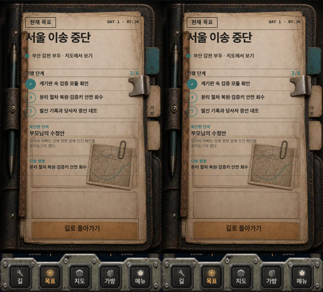
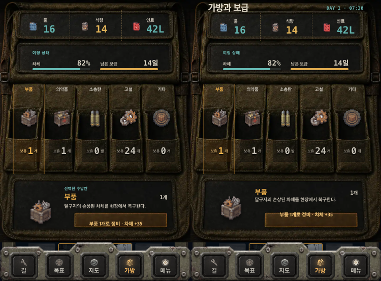
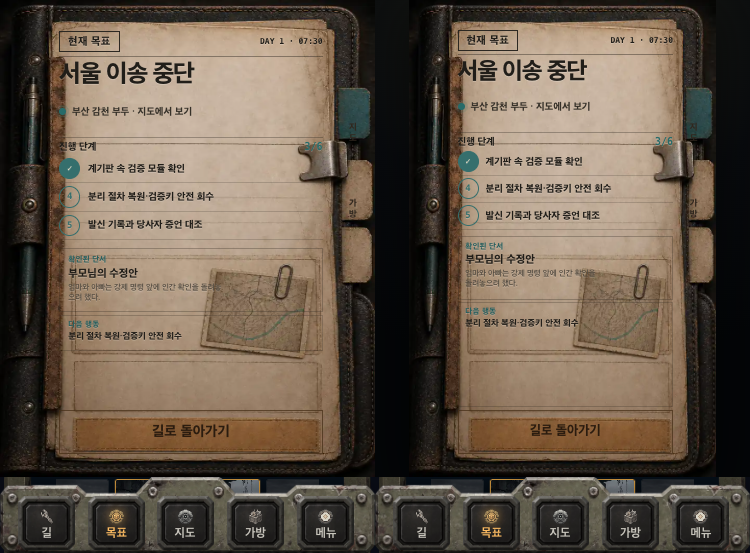
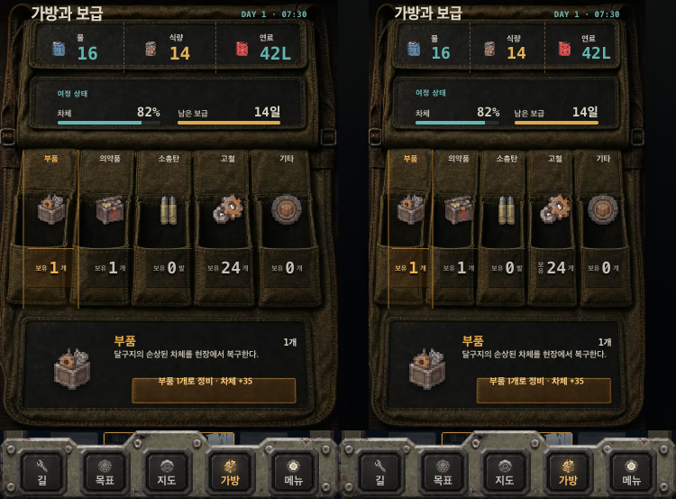
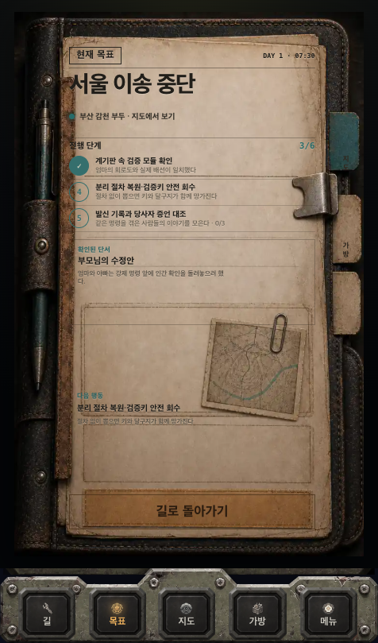
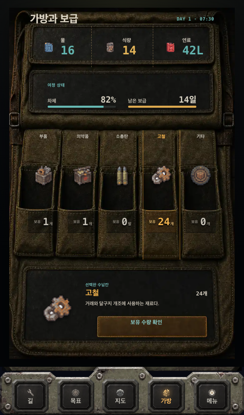

# 목표·가방 모바일 정렬 감사

- 날짜: 2026-08-15
- 범위: `목표` 폴리오와 `가방과 보급` 화면
- 기준 화면: 320×578, 375×553, 360×700, 390×664, 390×844, 390×664 큰 글자
- 결과: 수정 후 모든 기준 화면에서 가로 넘침 없음, 표시되는 핵심 조작부 44px 이상, 런타임 오류 없음

## 발견한 문제와 수정

### 1. 목표 우측 탭이 320px 화면 밖으로 나감 — 해결

- 수정 전: 우측 끝 `323.30px`로 화면보다 약 `3.30px` 돌출
- 수정 후: 우측 끝 `319.81px`, 버튼 폭 `44px`를 유지하면서 화면 안에 완전히 수용
- 조치: 폴리오의 종이 폭과 시각 비율은 유지하고 우측 탭 위치만 화면 경계에 맞춤

### 2. 짧은 화면에서 가방 제목이 사라짐 — 해결

- 수정 전: 높이 650px 미만에서 `가방과 보급` 제목 행 전체를 숨김
- 수정 후: 제목과 시간이 모든 기준 화면에 유지됨
- 조치: 제목 대신 상세 카드의 보조 라벨만 생략해 정보 위계를 보존

### 3. 가방 상세 내용이 상세 패널 아래로 넘침 — 해결

- 수정 전: 375×553에서 상세 패널 하단 `456.50px`, 내용 하단 `463.44px`
- 수정 후: 상세 패널 하단 `456.50px`, 내용 하단 `445.98px`
- 조치: 상세 카피를 세로 중앙 정렬하고 제목·수량을 안정적인 2열 그리드로 변경

### 4. 보이지 않는 중복 내비게이션이 가방 위에 겹침 — 해결

- 수정 전: 하단 주요 메뉴와 별개인 투명 도구 탭이 수납칸 영역 위에 존재해 탭 충돌 가능
- 수정 후: 중복 탭 제거, 하단 주요 메뉴만 단일 내비게이션으로 사용

## 검증

- `python3 tests/test_goal_bag_alignment.py` — 통과
- `npm run verify:quick` — 통과
- `python3 tests/test_quality_9_accessibility.py` — 통과
- `python3 tests/test_smoke.py` — 통과
- 목표·가방 자동 회귀 화면: `before-*`, `after-*`

## 판정

목표의 돌출, 가방 제목 누락, 상세 패널 넘침, 중복 터치 레이어를 모두 재현한 뒤 수정했다. 현재 목표와 가방은 가장 좁고 짧은 기준 화면에서도 핵심 정보와 조작부가 화면 안에 정렬되며, 큰 글자·동작 줄이기·200% 확대 검증도 통과한다.

## 정밀 재조정

추가 검토에서 화면 밖 넘침과 별개로 두 가지 시각 문제가 남아 있음을 확인했다.

1. 높이가 짧은 화면에서 패널 폭은 그대로인데 높이만 줄어 720:1120 물건 비율이 0.6429에서 0.7862까지 찌그러졌다.
2. 목표의 `다음 행동` 영역이 실제 종이 프레임보다 작게 렌더링되어, 아래가 비어 있고 덜 완성된 것처럼 보였다.

수정 후:

- 모든 기준 화면에서 목표·가방 비율을 0.6429로 유지한다.
- 물건은 화면 중앙에 배치되고 좌우 여백 차이는 1px 이하이다.
- 320px 화면에서도 외곽과 화면 사이에 4px 안전 여백이 남는다.
- 목표의 `다음 행동` 영역은 종이 프레임 전체를 사용하며 하단 버튼과의 간격은 8px 이하이다.
- 가방의 제목·자원·차체·수납칸·상세 패널은 원본 가방 슬롯 비율과 함께 축소된다.

정밀 조정 후 목표·가방 정렬 테스트, Quality 9 접근성 게이트, 콘텐츠 검증, 전체 스모크 테스트를 모두 다시 통과했다.

## 사용자 화면 재현 후 수정

2026-08-15 19시 사용자 화면(약 462×832, 476×809 CSS 화면에 해당)을 다시 대조하니 기존 판정에 남은 문제가 확인됐다.

1. 목표의 `다음 행동`이 내용 없는 별도 테두리 박스로 늘어나 종이 하단 대부분을 비웠다.
2. 목표와 가방 소품이 넓은 화면에서 거의 끝까지 커져 외곽 실루엣과 화면 여백의 구분이 사라졌다.
3. 가방의 `보유`, 숫자, 단위가 따로 벌어져 특히 `보유 2 개`처럼 보였다.

수정 후:

- 목표의 중복 테두리를 없애고, 다음 행동 제목과 설명을 종이에 인쇄된 지도 옆 영역 안에 세로 중앙 정렬했다.
- 목표·가방 모두 최대 폭 440px과 좌우 8px 이상의 안전 여백을 적용했다.
- 가방 수량을 `보유` + `2개` 구조로 묶고 숫자 크기를 낮춰 다섯 수납칸의 리듬을 맞췄다.
- 사용자 화면에 가까운 462×832와 476×809를 자동 회귀 화면 및 정렬 테스트에 추가했다.

최종 검증은 320×578, 375×553, 360×700, 390×844, 462×832, 476×809에서 실행하며, 모든 화면에서 720:1120 소품 비율, 좌우 8px 이상 여백, 44px 핵심 조작부, 가로 넘침 없음이 유지된다.
