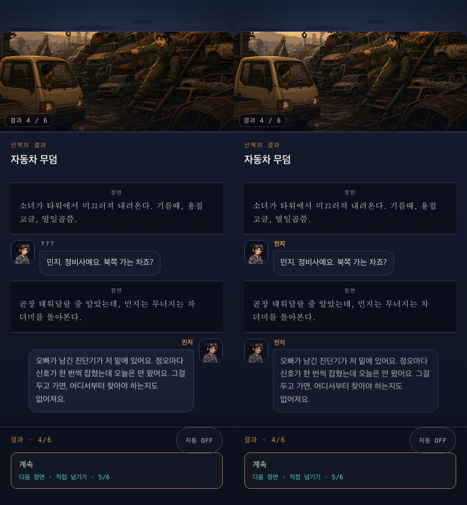

# 모바일 내러티브 RPG 일관성 감사

- 일시: 2026-08-01
- 기준 화면: 390 × 844 px 모바일 뷰포트
- 범위: 인트로, 사건 대화, ???→실명 공개, 선택→결과, 자동 진행, 동료 합류 연쇄, 1화 서울 해방 스토리
- 상태: **Healthy — 주요 일관성 버그 수정 및 전체 스모크 통과**

## 리서치 기준

- Apple은 게임 UI에서 일관성·명확한 계층, 맥락에 맞는 컨트롤, 44×44 pt 이상의 주요 터치 표적을 권장한다.
  <https://developer.apple.com/design/human-interface-guidelines/game-controls>
  <https://developer.apple.com/design/human-interface-guidelines/designing-for-games/>
- Ren'Py의 기본 구조처럼 대사는 명시적 화자에, 내레이션은 비화자 블록에 속해야 한다. 대화 단위와 화자 UI를 분리하는 것이 판독성의 기초다.
  <https://www.renpy.org/doc/html/dialogue.html>
  <https://www.renpy.org/doc/html/side_image.html>
- 자동 넘김은 사용자가 끌 수 있어야 하며, 선택지에서는 멈추는 것이 안전하다. Ren'Py도 자동 진행·선택 후 건너뛰기를 독립 설정으로 다룬다. W3C도 자동 변경이 읽기 시간을 제한하지 않도록 중지·조절 수단을 제공하라고 권장한다.
  <https://www.renpy.org/doc/html/preferences.html>
  <https://www.w3.org/WAI/WCAG22/Understanding/timing-adjustable.html>
- 대사마다 같은 이미지를 재크롭·확대하는 비필수 움직임은 집중을 흐리고 불편을 유발할 수 있다. 움직임은 정보나 상태 변경을 설명할 때만 쓴다.
  <https://developer.apple.com/design/human-interface-guidelines/motion>
  <https://www.w3.org/WAI/WCAG22/Understanding/animation-from-interactions>
- 분기는 결과와 상태를 추적해야 하며, 이어지는 선택은 조건에 따라 표시되어야 한다.
  <https://github.com/inkle/ink/blob/master/Documentation/WritingWithInk.md>

## 수정 전·후 근거

- 좌측(수정 전): `minji::???`와 `minji::민지`를 다른 화자로 계산해 실명 공개 직후 반대쪽 레인으로 이동했다.
- 우측(수정 후): 표시 이름을 버리고 `speaker:minji`를 기준으로 레인을 유지한다. 자기소개 문장은 바로 `민지`로 표시되고, 이후 대사도 같은 좌측 레인을 쓴다.

## 발견과 조치

1. **화자 시각 일관성 — Critical → Fixed**
   - 레인을 표시 이름이 아닌 불변 인물 ID로 계산한다.
   - 이벤트 본문→선택 결과에서도 기존 레인 맵을 이어받는다.

2. **신원 공개 시점 — High → Fixed**
   - `민지. 정비사예요.`에 `???`가 붙던 오류를 수정했다.
   - 여섯 동료(민지·박 선생·레오·재이·은수·강우) 모두에 대해 `??? → 자기소개 문장의 실명 → 이후 실명 유지`를 회귀 검사한다.

3. **장면 안정성 — High → Fixed**
   - 같은 사진을 쓰는 선택→결과에서 구도·확대률을 그대로 승계한다.
   - 실제 장면 키가 바뀐 때만 재크롭 전환을 한다.
   - OS의 동작 축소 설정에서 장면·대화 전환 애니메이션이 비활성화되는 기존 처리를 유지했다.

4. **자동 진행과 회상 탐색 — Medium → Fixed**
   - `자동 ON/OFF`과 선택지 자동 정지를 유지했다.
   - 플레이어가 지난 대화를 올려 보는 동안은 `자동 대기`로 바뀌고 타이머를 멈춘다. 최신 대사로 돌아오면 다시 읽기 시간을 준다.

5. **모바일 조작 — Pass**
   - 선택·진행 버튼 48 px 이상, 선택지 독립 스크롤, 고정 진행 독, safe-area 적용을 확인했다.

6. **스토리 인과·연대기 — Pass**
   - 현재는 2169년, 첫 이송은 143년 전 2026년, 강우·은수의 추방은 각자가 직접 겪은 후대 사건으로 분리되어 있다.
   - 가족의 직접 추방 이유(부모의 인간 확인층을 천리안이 위험으로 분류)와 143년 전 최초 조건의 목적(미확인)을 섞지 않는다.
   - 주인공의 목표는 제7 잔류구역 6,412명의 현재 이송을 멈추고, 부모의 검증키로 서울의 집행권을 사람에게 돌려주는 것이다.
   - 동료 6명 모두 `첫 만남 → 지역 과제 → 임시 동행 → 두 번째 사건 → 합류 약속`을 거친다. 바로 태우는 경로는 없다.
   - 1화는 서울의 반복 정리를 중지하고 제7 구역을 해방하는 데서 완결된다. 상위 발신자는 답을 주지 않고 수신등 한 번의 떡밥만 남긴다.

## 검증 결과

- 스모크: 전부 통과, 종료 코드 0
- 대사 린트: 3,766줄, 몰입 파괴 항목 0건
- 이벤트: 866종 표시·화자·선택 잠금 회귀 통과
- 이미지: 시네마틱 105종 주입, 전 이벤트가 전용·지역·유형 장면 중 하나를 가짐
- 타임라인 금지어: 폐기된 `3년` 설정, 미만남 `정 박사`, 할아버지의 `KOR-LOCAL` 제품명 직접 설명 등 0건

## 남은 플레이테스트 권장

정적 검사와 자동 회귀는 통과했다. 다만 첫 플레이 30분에서 플레이어가 체감하는 대사 속도·사건 밀도·동료 애착 생성 속도는 3–5명 관찰 플레이테스트로 확인하는 것이 남았다.
