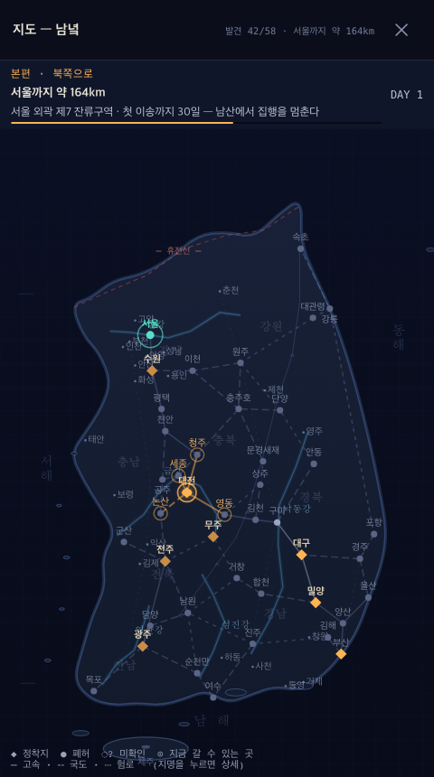
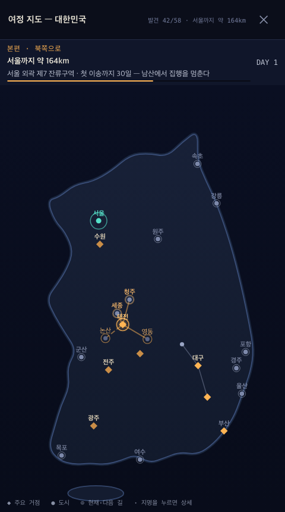
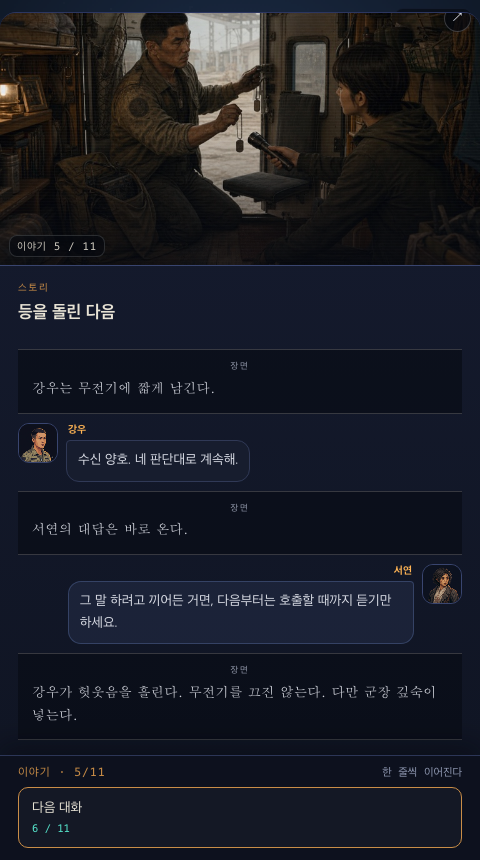

# 자연스러움·지도 감사 — 2026-08-01

## 범위

480×860 모바일 화면에서 인트로 대화, 대한민국 여정 지도, 강우 합류 대화를
새 게임 기준으로 캡처했다. 정적 대사 3,766줄 검사와 전체 브라우저 스모크도 함께 실행했다.

## 1. 인트로 대화 — 양호

- 아이의 질문 뒤에 할아버지가 답하고 다음 질문으로 이어지는 순서가 분명하다.
- 내레이션과 두 화자의 좌우 말풍선이 구분된다.
- `서울 집`을 `서울에 있는 우리 집`으로 고쳐 어린아이의 말이 자연스럽게 들리게 했다.

## 2. 여정 지도 — 수정 전 혼잡 / 수정 후 양호

수정 전에는 강 5개, 산맥, 지역명, 바다 글자, 보조 도로, 주변 도시와 전체 미래
경로가 동시에 보여 현재 위치와 목적지가 묻혔다.

- 대한민국 윤곽과 제주 실루엣만 배경으로 남겼다.
- 서울·수원·대전·대구·광주·부산 등 주요 도시만 상시 표시한다.
- 작은 경유지는 현재 위치·방문 기록·다음 이동 후보일 때만 보인다.
- 길은 이미 지나온 구간과 지금 갈 수 있는 구간만 보인다.

## 3. 동료 합류 대화 — 양호

- 강우의 확인, 서연의 응수, 강우의 반응 순서가 자연스럽고 화자 얼굴도 맞다.
- 내레이션은 전체 폭, 사람 대사는 좌우 레인으로 유지된다.

## 접근성 메모와 한계

- 지도 캔버스에는 `대한민국 주요 도시와 서울행 경로 지도`라는 대체 이름이 있다.
- 도시 선택은 포인터 기준 캔버스 상호작용이라 키보드·스크린리더의 개별 도시 탐색은
  별도 실기기 접근성 검사가 필요하다.
- 스크린샷으로 음량 균형이나 실제 기기 모션 체감은 판정하지 않았다.

## 검증

- 대사 린트: 3,766줄, 몰입 파괴 항목 0건
- Chromium 전체 스모크: 통과, 콘솔 오류 0건
- 지도 레이어: 강 이름·보조 도로·지역명 제거 확인
- 최신 HTML·AIT 재생성 완료
