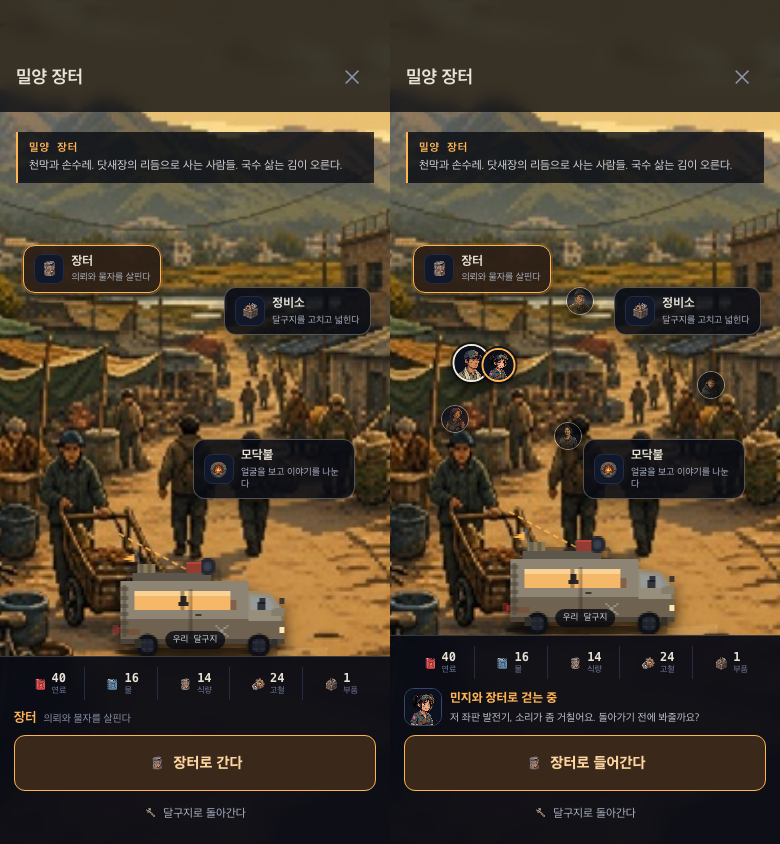
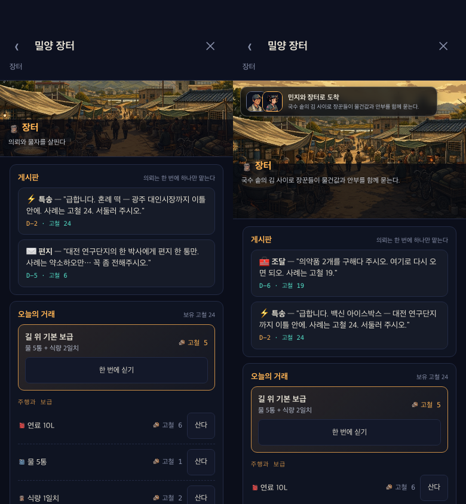
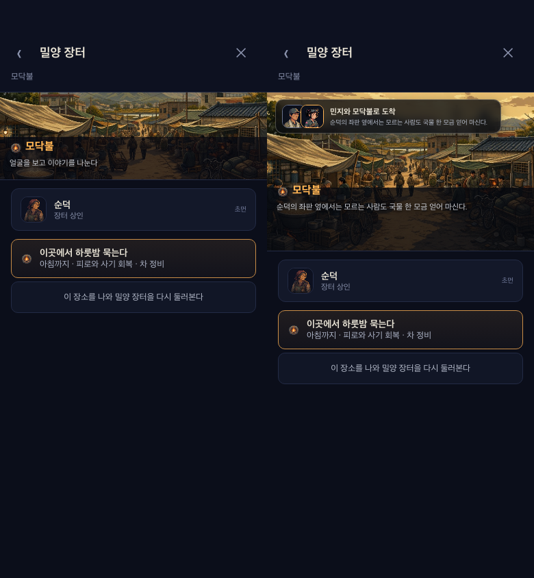
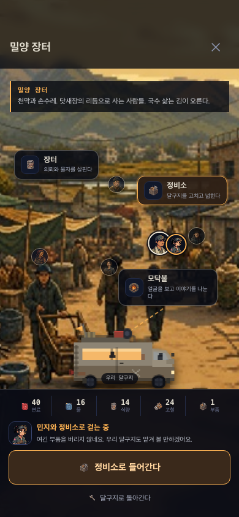
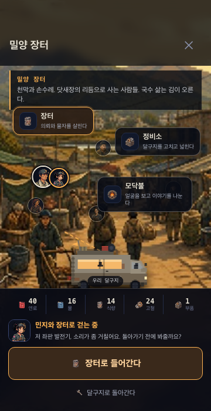

# 정착지 동행 탐색 감사·개선 보고서

- 일자: 2026-08-01
- 범위: 밀양 장터 입장 → 장터/정비소/모닥불 선택 → 내부 기능 화면
- 검증 화면: 390×844, 360×700 모바일 뷰포트
- 이미지 정책: 신규 생성 없음. 기존 정착지 장면과 실제 인물 초상만 사용

## 결론

기존 정착지는 첫 허브만 장면이 크게 보이고, 내부 화면에서는 같은 장면이 높이 128px의 작은 배너로 축소됐다. 또한 동료가 탑승 중이어도 정착지 화면에는 나타나지 않아 장소 선택이 정적인 메뉴 전환처럼 느껴졌다.

현재는 내부 장면을 190~232px로 확대하고, 주인공과 현재 동료가 선택한 장소까지 함께 이동하는 탭 기반 탐색으로 변경했다. 동료가 없는 경우 주인공만 표시한다. 모든 정착지에는 장소별 현장 묘사를, 여섯 동료에게는 장터·정비소·사람들에 대한 고유 반응을 추가했다.

## 모바일 흐름 상태

1. **정착지 도착 — 양호**
   - 전체 화면 장면, 달구지, 자원, 세 장소가 한 화면에서 식별된다.
   - 주인공과 현재 동료가 장면 위에 함께 표시된다.
   - 기존 인물 초상을 재사용해 화면의 그림체 일관성을 유지했다.

2. **장소 선택과 이동 — 양호**
   - 장터·정비소·모닥불을 누르면 선택 상태, 이동 경로, 하단 행동 문구가 한 번에 바뀐다.
   - 주인공과 동료 토큰이 새 장소로 이동하며, 저감 모션 설정에서는 애니메이션을 제거한다.
   - 선택할 때 전체 허브를 다시 그리지 않아 화면 깜빡임이 없다.

3. **장터·사람들 내부 진입 — 양호**
   - 장면 높이를 128px에서 최대 232px로 확대했다.
   - 상단에 주인공·동료 초상과 “함께 도착” 맥락을 유지한다.
   - 게시판, 거래, NPC, 숙박 기능은 기존처럼 아래로 스크롤된다.

4. **작은 모바일 화면 — 양호**
   - 360×700에서는 장면을 190px로 제한해 기능 목록의 가시 영역을 확보한다.
   - 달구지, 장소 버튼, 동료 토큰, 하단 행동 버튼이 서로 가리지 않는다.
   - 주요 터치 버튼은 44px 이상을 유지한다.

## 비교 증거

### 도착 허브: 왼쪽 이전 / 오른쪽 개선

### 장터 내부: 왼쪽 128px 배너 / 오른쪽 232px 장면과 동행 맥락

### 사람들 내부: 왼쪽 작은 배너 / 오른쪽 확대 장면과 동행 맥락

### 민지와 정비소 쪽으로 이동한 상태

### 작은 화면 360×700

## 구현 범위와 다음 확장선

이번 변경은 현재 게임 구조에 맞춘 **탭해서 걷는 포인트 앤 클릭형 마이크로 탐색**이다. 가상 조이스틱으로 캐릭터를 자유 이동시키는 별도 2D 맵은 아니다. 다음 단계에서 장터 자체를 독립 플레이 공간으로 확장한다면 좌판 4~6개, 현장 NPC 순환, 동료별 짧은 행동, 하루 한 번의 발견 상호작용을 추가하는 편이 적절하다.

## 검증

- `node --check src/03-data.js`: 통과
- `node --check src/07-ui.js`: 통과
- `npm run lint:dialogue`: 몰입 파괴 항목 0건
- `python3 tests/test_smoke.py`: 전체 통과, 콘솔 오류 0
- 정착지 신규 회귀 검사: 동료 표시, 장소 이동 상태, 확대 장면, 내부 동행 맥락 모두 통과
- 최신 HTML 및 AIT 번들 재생성 완료
