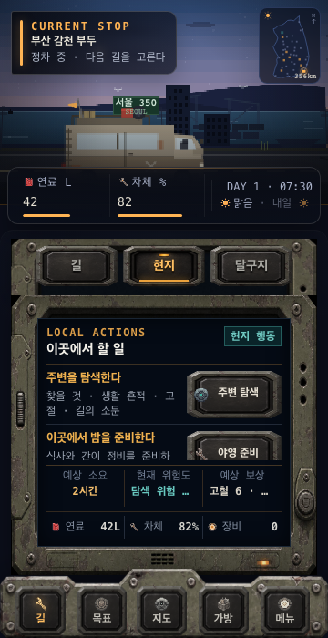
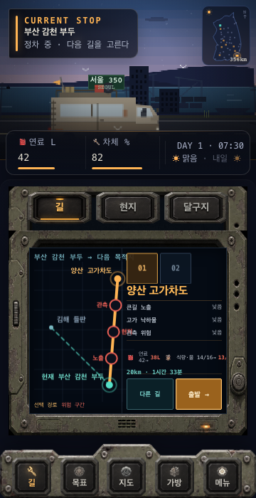
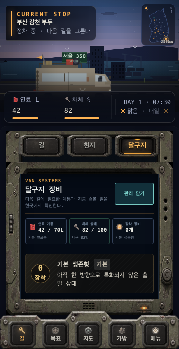

# Caravan 정차 통합 콘솔 UI QA

- 감사일: 2026-08-10
- 기준 화면: 360 × 700, device scale factor 1
- 대상 커밋: `47a6e10`
- 범위: 정차 상태의 `현지 / 길 / 달구지` 전환 경험
- 감사 방식: 현재 빌드를 새로 실행해 세 상태를 캡처한 뒤 시각·UX·접근성 위험을 검토

## 전체 판정

**실패 — 지금 상태를 완성본으로 두면 안 된다.**

세 기능을 하나의 콘솔에 합친 정보 구조 자체는 맞지만, 실제 360px 화면에 제작 시안의 금속 프레임과 생산 데이터를 그대로 넣으면서 콘텐츠 공간이 지나치게 줄었다. 그 결과 `현지`는 행동이 잘리고, `길`은 핵심 정보가 읽기 어렵고, `달구지`는 열린 관리 내용이 보이지 않는다.

## 캡처 단계

### 1. 현지 행동 — 나쁨

- **P1 · 두 번째 행동이 잘린다.** `야영 준비` 버튼과 설명의 하단이 고정 요약 바 뒤로 사라진다. 사용자는 버튼 전체와 상태를 한 번에 확인할 수 없다.
- **P1 · 고정 높이와 실제 콘텐츠가 충돌한다.** 행동 목록만 내부 스크롤되고 요약/자원 바는 고정되어, 한 화면 안에서 서로 다른 스크롤 규칙이 겹친다.
- **P2 · 같은 의미가 반복된다.** 왼쪽 행동 제목과 오른쪽 CTA가 거의 같은 말을 반복해 좁은 화면을 더 낭비한다.
- **P2 · 하단 요약이 잘린 내용을 대신하지 못한다.** `고철 6 · …`처럼 값이 생략돼 예상 보상이 명확하지 않다.

좋은 점: `현지` 선택 상태와 탐색/야영의 구분은 빠르게 이해된다. Caravan 풍경도 충분히 남아 있다.

### 2. 목적지 네비게이션 — 기능은 있으나 읽기 어려움

- **P1 · 핵심 정보가 너무 작다.** 지도 라벨, 위험 종류, 자원 변화가 좁은 2열 화면에 들어가며 실제 선택 전에 읽어야 할 정보가 미세해졌다.
- **P1 · 지도와 의사결정 영역이 서로 공간을 뺏는다.** 둘 다 중요하지만 어느 쪽도 충분한 크기를 받지 못한다. 특히 위험과 보급 정보가 시각적으로 약하다.
- **P2 · `길`이 두 번 선택되어 보인다.** 상단 모드의 `길`과 하단 주 내비게이션의 `길`이 동시에 주황색이라 현재 위치와 내부 모드의 계층이 혼동된다.
- **P2 · 선택 방식이 중복된다.** `01/02` 목적지 탭과 `다른 길` 버튼이 같은 전환을 두 방식으로 제공한다.

좋은 점: 현재 위치, 선택 경로, 위험 구간, 목적지와 출발 버튼은 한 장치 안에 존재한다. 데이터와 실제 출발 동작도 연결돼 있다.

### 3. 달구지 장비 관리 열림 — 나쁨

- **P1 · 열렸다는 결과가 보이지 않는다.** 버튼은 `관리 닫기`로 바뀌었지만 새 관리 항목은 화면 아래 내부 스크롤 영역에 숨어 있다. 클릭 직후 사용자가 보는 화면은 거의 그대로다.
- **P1 · `달구지` 탭 안에 다시 관리 토글이 있다.** 사용자는 이미 장비를 보기 위해 `달구지`를 선택했다. 그 안에서 다시 `장비 관리`를 눌러야 하는 이중 진입 구조가 불필요하다.
- **P2 · 3열 시스템 카드가 지나치게 좁다.** 연료·차체·장비 값과 설명이 작은 글씨와 축약된 문장으로 보인다.
- **P2 · `기본 생존형 / 기본`이 중복된다.** 빌드명과 등급이 같은 의미처럼 보여 정보 가치가 낮다.
- **P2 · 내부 스크롤 가능 여부가 보이지 않는다.** 스크롤 표시나 다음 내용의 일부가 없어 아래에 정비 행동이 있다는 사실을 알아차리기 어렵다.

좋은 점: 연료·차체·장착 장비의 세 범주는 적절하고, 현재 상태를 한눈에 비교하려는 의도는 명확하다.

## 공통 구조 문제

1. **프레임이 콘텐츠보다 강하다.** 모드 선택용 금속 프레임, 본체 프레임, 하단 내비게이션 프레임이 연속되면서 실제 정보 화면이 360px 폭의 일부만 사용한다.
2. **세 모드에 같은 높이를 강제한 판단이 틀렸다.** `길`은 지도와 판단 정보가 필요하고, `현지`는 2–4개 행동이 필요하며, `달구지`는 상세 관리가 필요하다. 동일한 내부 높이로 해결하려다 글자 축소·잘림·숨은 스크롤이 발생했다.
3. **상위/하위 내비게이션이 경쟁한다.** 하단 `길`과 내부 `길/현지/달구지`가 모두 같은 강도의 선택 상태를 사용한다.
4. **기능을 숨겼는데 공간은 절약되지 않았다.** 패널을 탭으로 바꿨지만 두꺼운 탭 프레임과 본체 프레임 때문에 Caravan 아래의 UI 높이는 여전히 크다.

## 접근성 위험

- 경로와 차량 화면의 보조 텍스트가 육안으로 매우 작다. 실제 글자 크기와 대비는 별도 측정이 필요하지만, 현재 캡처만으로도 빠른 판독이 어렵다.
- 잘린 행동과 말줄임표는 확대/긴 한국어 문구에서 더 악화될 가능성이 높다.
- 내부 스크롤 영역에 시각적 단서가 없고, 스크롤 영역 자체의 키보드 접근성은 스크린샷만으로 확인할 수 없다.
- 선택 탭은 색뿐 아니라 밑줄과 눌린 면을 사용해 구분되는 점은 긍정적이다.
- 버튼 크기는 대체로 충분해 보이지만 실제 터치 영역과 스크린리더 탭 관계는 별도 DOM 검증이 필요하다.

## 수정 우선순위

### 1순위 — 즉시 수정

1. `현지`에서 기본 행동 두 개와 CTA 전체가 스크롤 없이 보여야 한다. 요약 바가 행동을 덮지 않도록 레이아웃을 다시 나눈다.
2. `달구지` 탭의 `장비 관리` 토글을 없앤다. 핵심 정비 행동을 바로 보여주거나, 상세 관리는 별도 전체 화면/드로어로 연다.
3. `길` 화면에서 지도와 판단 정보를 동시에 2열로 압축하지 않는다. 모바일에서는 지도 우선 + 선택 목적지 요약 한 줄, 상세 위험은 눌러서 여는 구조가 적합하다.

### 2순위 — 구조 정리

4. 내부 탭 이름을 `목적지 / 현지 / 달구지`로 바꿔 하단 `길`과의 중복을 줄인다.
5. 모드 탭의 금속 프레임 높이를 절반 가까이 줄이고, 본체 베젤 안쪽 헤더에 통합한다.
6. `01/02` 탭과 `다른 길` 중 하나만 남긴다.
7. 현지 행동 카드의 왼쪽 제목과 오른쪽 CTA 중복을 제거한다.

### 3순위 — 시각 다듬기

8. 보조 글자와 수치의 최소 판독 크기를 통일한다.
9. 긴 보상·장비 문구는 말줄임표 대신 두 줄 또는 상세 보기로 처리한다.
10. 내부 스크롤이 필요한 화면은 다음 항목의 일부나 스크롤 표시를 보여준다.

## 권장 최종 구조

- 하단 `길` 탭: 여정 전체 영역을 뜻한다.
- 콘솔 상단의 얇은 세그먼트: `목적지 / 현지 / 달구지`.
- `목적지`: 지도 중심, 선택 목적지와 출발 CTA만 항상 표시. 위험·보급 상세는 탭/드로어.
- `현지`: 최대 두 개의 주요 행동을 완전히 표시. 추가 행동은 `더 보기` 드로어.
- `달구지`: 세 상태와 가장 필요한 정비 행동 하나를 즉시 표시. 전체 장착/정비는 별도 화면.
- 금속 외곽은 하나만 유지하고, 중첩된 프레임은 제거한다.

## 증거 한계

- 이번 감사는 새로 캡처한 360 × 700 시각 상태를 중심으로 했다.
- 스크린리더 발화 순서, 실제 터치 정확도, 모든 도시의 3개 이상 행동 상태, 장비가 많은 후반 데이터는 이번 캡처만으로 확인하지 않았다.
- 코드 수정은 하지 않았다.
