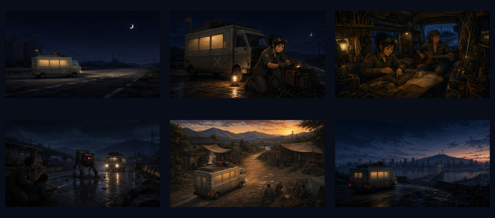
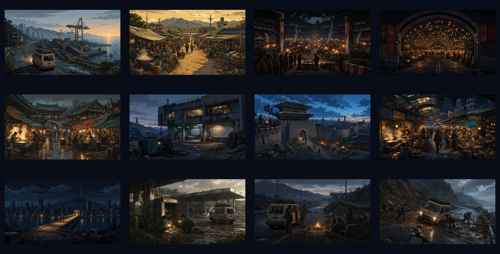
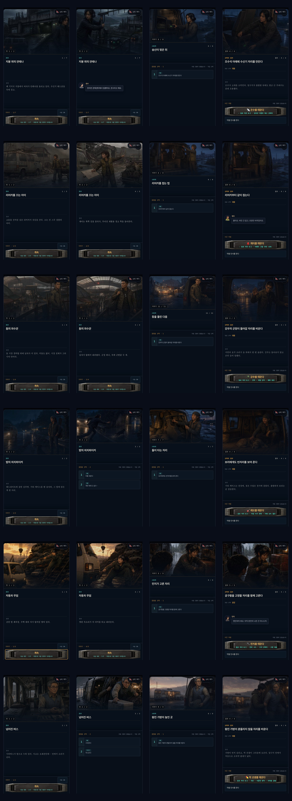
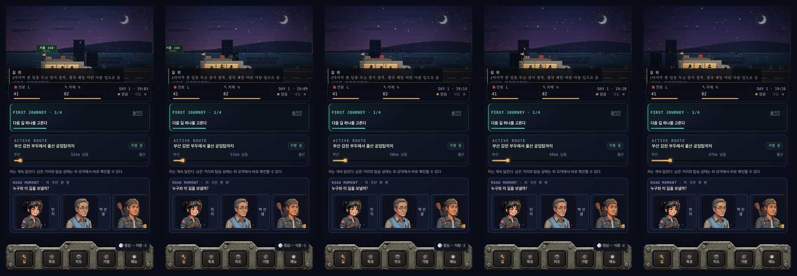

# Caravan trailer alignment audit

Date: 2026-08-11
Surface: current `서울까지400km.html` build, mobile 480×860, source art, and existing trailer frames
Goal: decide whether the game's vehicle, characters, locations, events, motion, and visual language are coherent enough for a polished trailer.

## Overall verdict

**Trailer-ready, but not safe for blind automatic assembly.** The six main companions and the recognizable Caravan vehicle are strongly aligned. Major settlements also read as one Korean post-collapse world. The main remaining gap is not character identity; it is the transition between the pixel/canvas gameplay layer and the painterly cinematic layer. A trailer should deliberately intercut both instead of pretending the cinematic stills are the moment-to-moment game graphics.

Recommended production mix: **roughly 60% cinematic scene art and 40% real gameplay/UI**, with the same dark-blue shadows, warm amber practical lights, restrained camera movement, and radio/metal-frame transitions applied across both.

## Evidence captured in this run

- 34 current gameplay and overlay screenshots
- 24 current companion sequence screenshots: setup, action, join, and decision for all six companions
- 12 current major-settlement and representative-event screenshots
- 5 current driving cadence frames plus a five-second motion sample
- Source review: 114 scene JPGs, 38 portraits, 17 intro JPGs, and 6 existing trailer start frames

### Existing trailer frame set

### Main world source art

### Companion continuity in the actual event UI

### Current driving cadence

## Numbered flow review

1. **Gameplay baseline — healthy**
   - The beige Caravan, blue-black sky, amber light, dark navy panels, worn metal shell, and orange/teal state colors form a recognizable baseline.
   - Navigation, settlement, garage, event, and status screens share the same physical-console language.
   - Trailer implication: actual UI footage can be cut together without rebuilding a separate visual identity.

2. **Caravan identity and movement — healthy with one production constraint**
   - The gameplay vehicle and the six trailer frames share the same boxy converted-camper silhouette, warm side windows, rooftop load, worn neutral paint, and faded side marking.
   - Upgrades lengthen the living body and add visible windows while preserving the cab and main silhouette.
   - Current gameplay motion is deliberately heavy and measured: the background advances at 64 px/s on a 480 px stage, while the body bounce is small. It reads as a loaded home on wheels, not a fast action vehicle.
   - Trailer constraint: use slow push-ins, 2.5D parallax, and restrained shake. Racing-speed road footage would contradict the game.

3. **Six main companions — excellent**
   - Minji: tied hair, goggles, mechanic workwear, and grease-dark palette stay stable.
   - Park Seong: grey hair, glasses, sweater vest, age, and medical-bus setting stay stable.
   - Leo: head wrap, long hair, guitar, casual jacket, and dog relationship stay stable.
   - Jaeyi: short curls, olive/mustard workwear, compact build, and salvage role stay stable.
   - Eunsu: short bob, headphones/radio gear, dark technical workwear, and reserved expression stay stable.
   - Kangwoo: cropped hair, military field jacket, upright posture, and guarded expression stay stable.
   - The runtime capture also confirmed that each setup/action/join/decision image is wired to the intended companion scene key.

4. **Major settlements — healthy**
   - Busan, Miryang, Daegu, Muju, Jeonju, Daejeon, Suwon, Gwangju, and Seoul have distinguishable visual identities.
   - Their weather and color temperatures vary, but the rendering, material decay, Korean architecture, improvised lighting, and human scale hold the world together.
   - Trailer implication: geographic progression will feel meaningful rather than like repeated generic backgrounds.

5. **Intro and event art — mostly healthy**
   - Intro art and recent character/event scenes use compatible cinematic realism, dark practical lighting, wet concrete, oxidized metal, and warm interiors.
   - Some small local events still use shared `generic-*` images. This is acceptable in play but would look repetitive in a short trailer.
   - Trailer constraint: use the unique companion, settlement, road-action, and Seoul scenes; exclude generic event art unless a missing beat requires it.

6. **Existing trailer frames — healthy with a medium/style gap**
   - The six frames align strongly with the recent intro and event paintings.
   - They are more photorealistic, darker, and more cinematic than the live canvas gameplay. This can look like two different games if cut directly without a bridge.
   - The rich interior frame should be presented as a mid/late-game payoff, not the Day 1 vehicle.
   - The walker confrontation works as an event beat, but the trailer should not imply that every road segment is combat-heavy.

7. **Asset delivery readiness — healthy after preparation**
   - Most scene art is 768×432. It will soften if enlarged directly to 1920×1080.
   - The six existing trailer frames are 1672×941 and need only light upscaling.
   - `miryang-market-hub.jpg` is a deliberate vertical 960×1200 exception, while the scene registry broadly declares 768×432. It needs a trailer-specific crop rather than generic 16:9 scaling.
   - Before InVideo assembly, selected 768×432 shots should be upscaled, cropped once, and color-matched as a locked source pack.

## Highest-impact risks

1. **Gameplay/cinematic medium gap:** solve with repeated metal-frame/radio transitions and a 60/40 cinematic-to-gameplay mix.
2. **Low source resolution:** upscale only the selected 10–12 cinematic shots before editing; do not let the editor repeatedly resize them.
3. **Minor NPC portrait variation:** portraits range from illustrated to near-photoreal rendering. This is subtle at the in-game 52–96 px size but should not be enlarged as full-screen trailer art.
4. **Generic scene repetition:** keep `generic-*` imagery out of the hero trailer.
5. **Misleading pace:** preserve the slow, weighty vehicle cadence; action should come from events and cuts, not from making the Caravan race.

## Accessibility and viewing risks

- Mobile gameplay text is too small to read in a normal 16:9 trailer frame. UI shots need a clear punch-in, not a full-phone view held at distance.
- Muted grey copy can disappear after video compression. Trailer captions should use high-contrast off-white with a dark backing plate.
- Avoid rapid flashes and high-frequency camera shake. The game's own motion is restrained, so calmer motion also matches the source.
- Screenshot review cannot verify assistive-technology behavior or full contrast compliance. This audit only supports trailer readability and visible interface consistency.

## Capture notes and limits

- The first synthetic navigation capture had a blank game canvas because the scene loop had not entered gameplay; it was rejected. The accepted navigation baseline comes from the full current gameplay capture.
- The van progression capture produced all five intended driving states, then its obsolete garage `seating` selector timed out. That later test-helper failure does not affect the accepted five vehicle states.
- Motion was checked through a five-second current-build sample and source motion constants. Audio mix, voiceover, and final edit rhythm have not been audited yet.

## Production decision

Use direct source images. Lock the character references and the Caravan silhouette. Curate rather than include everything. The current material is strong enough for a high-quality trailer once the selected images are upscaled and the gameplay/cinematic transition is designed intentionally.
