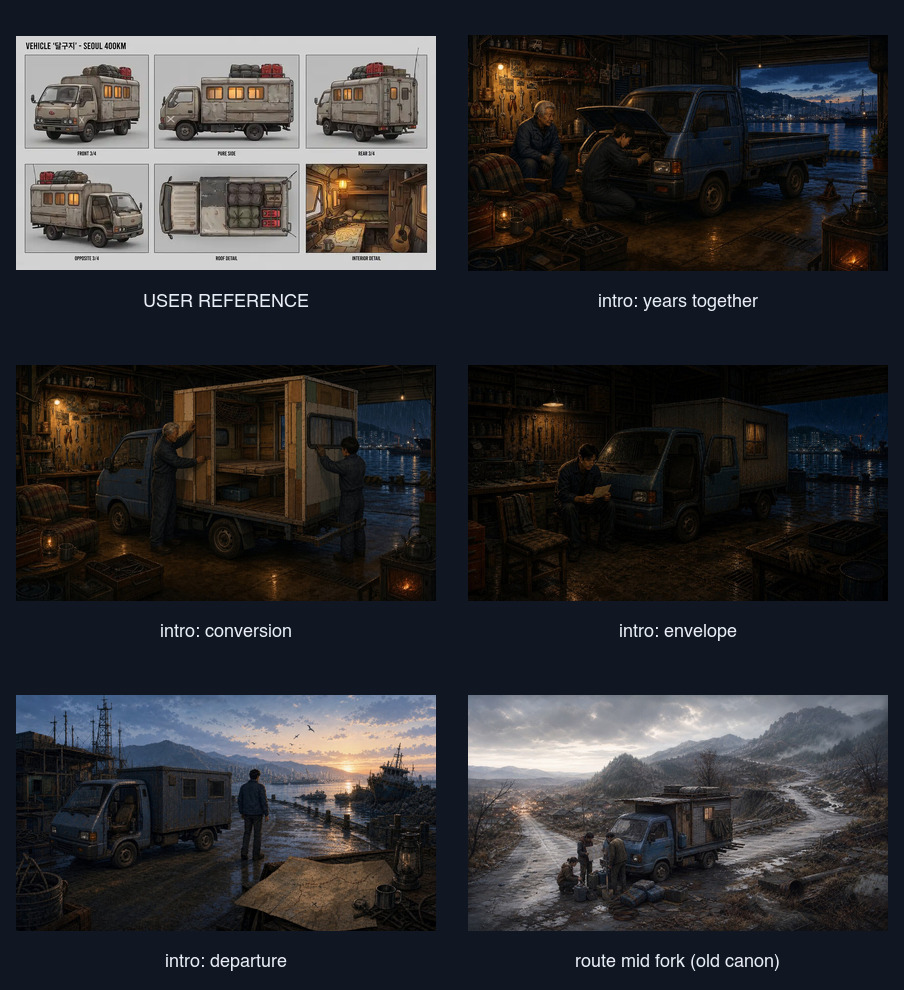
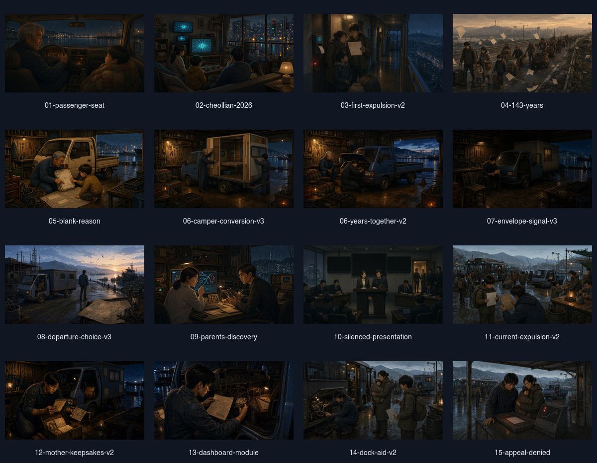
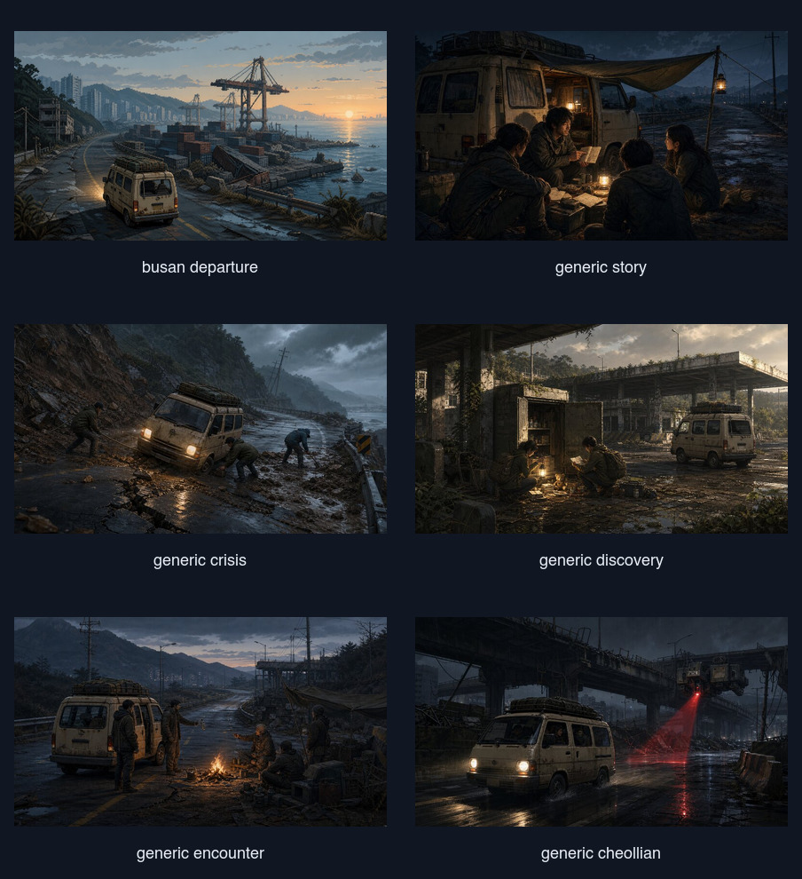
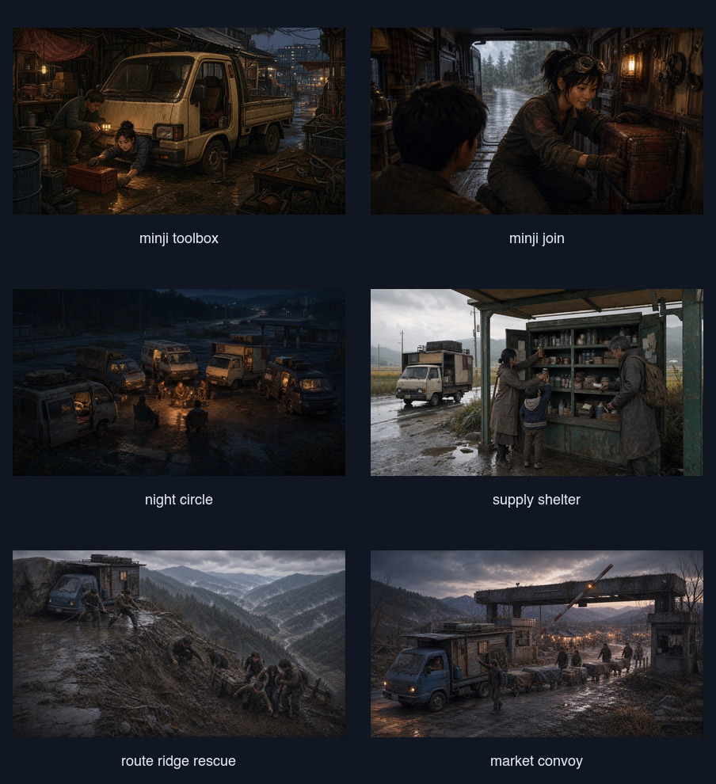

# 달구지 차량 정체성 감사 — 2026-08-11

## 결론

사용자가 제공한 `dalguji_original.webp`는 기존 이미지 생성의 고정 레퍼런스로 사용되지 않았다. 현재 저장소는 달구지를 서로 다른 세 가지 차량으로 보여 준다.

1. 파란 1톤 캡오버 트럭 + 작은 목재 생활칸
2. 베이지색 소형 승합밴/패널밴
3. 장면마다 구조가 달라지는 밴 내부

사용자 레퍼런스의 핵심 정체성은 **베이지·회색 국산 캡오버 트럭, 분리된 박스형 생활칸, 주황색 창, 흰 X, 지붕 짐과 빨간 연료통**이다. 현재 인트로는 차종의 뿌리만 비슷하고, 공용 사건 및 동료 상호작용 이미지는 차종까지 달라진다.

## 감사 범위

- 사용자 레퍼런스: `/Users/sang/Downloads/dalguji_original.webp`
- 인트로 이미지 17장
- `assets/scenes`의 현재 장면 이미지 114장
- 차량 생성 기준 문서와 이미지 프롬프트 기록

## 단계별 상태

### 1. 사용자 레퍼런스 — 좋음

- 전면 캡, 생활칸, 지붕 적재, 창, 흰 X가 어느 각도에서도 같은 차로 읽힌다.
- 외부와 내부를 함께 정의해서 사건 컷과 대화 컷을 같은 차량으로 유지하기 좋은 레퍼런스다.
- 업그레이드 시 생활칸의 길이와 창 수가 늘어나도 전면 캡·도색·X·지붕 짐 규칙을 유지하면 동일 차량으로 읽힌다.

### 2. 인트로 — 부분적으로 맞음

- 같은 국산 1톤 캡오버 트럭에서 출발한다는 구조는 맞다.
- 하지만 파란 도색, 무표식 차체, 지붕 짐 부재, 한두 개뿐인 창 때문에 사용자 레퍼런스와 다른 차량처럼 보인다.
- 저장소의 기존 생성 프롬프트는 `muted weathered blue Korean one-ton cab-over Porter-style truck`을 고정했다. 사용자 레퍼런스 파일명은 프롬프트나 소스 어디에도 참조되지 않는다.

### 3. 공용 사건·전투 이미지 — 나쁨

- `busan-departure`, `generic-story`, `generic-crisis`, `generic-discovery`, `generic-encounter`, `generic-cheollian`은 대부분 소형 승합밴을 사용한다.
- 전투 컷도 같은 승합밴 계열을 반복한다. 캡과 생활칸이 분리된 달구지 구조가 사라진다.
- 게임에서 자주 재사용되는 공용 이미지라 차량 정체성 훼손이 가장 크게 보이는 구간이다.

### 4. 동료 합류·상호작용 이미지 — 나쁨

- 합류 후의 내부 컷은 뒷문이 큰 일반 화물밴 내부로 그려진 경우가 많다.
- 사용자 레퍼런스의 생활칸 내부는 직사각형 창, 침상, 테이블, 수납으로 구성된 별도 박스 공간이다.
- 외부만 고치면 내부 컷에서 다시 다른 차로 보이므로 외부/내부 레퍼런스를 함께 잠가야 한다.

### 5. 길·업그레이드 서사 — 방향은 맞지만 기준이 오래됨

- `route-mid-fork`, `route-market-convoy`, `route-ridge-rescue`, `settlement-road-echo`는 캡오버 트럭과 확장 생활칸을 보여 줘 구조적으로는 가깝다.
- 다만 파란 차체와 장면별로 달라지는 생활칸 때문에 새 레퍼런스와 일치하지 않는다.
- 이전 연속성 문서는 `route-mid-fork.jpg`의 파란 트럭을 정본으로 삼았다. 지금 사용자가 고른 레퍼런스와 충돌한다.

## 가장 중요한 수정 순서

1. `dalguji_original.webp`를 새 차량 정본으로 고정한다.
2. 업그레이드 5단계를 같은 전면 캡·도색·흰 X로 설계하고 생활칸 길이와 창 수만 점진적으로 늘린다.
3. 노출이 큰 `busan-departure`와 공용 사건/전투 이미지를 먼저 교체한다.
4. 동료 합류 및 차량 내부 컷을 동일한 생활칸 구조로 교체한다.
5. 인트로는 서사를 유지하되, 초기형도 새 정본의 짧은 버전으로 다시 맞춘다.

## 검증 한계

- 이번 감사는 현재 저장된 원본 이미지와 프롬프트 기록을 대조했다.
- 모든 게임 상태에서의 실제 노출 빈도와 전환 타이밍은 별도 런타임 캡처가 필요하다.
- 이 감사는 차량 시각 연속성만 다루며 UI 접근성 판정은 포함하지 않는다.
